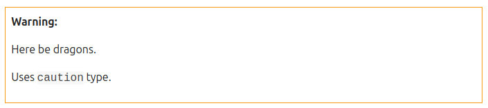

(contribute-to-discourse-documentation)=
# Contribute to Discourse documentation

Our documentation is a community effort and we warmly welcome community contributions, suggestions, fixes and constructive feedback.

Some of our documentation is created and edited in posts on Discourse forums.
Every such documentation page has an equivalent post on a Discourse forum.
Each forum post can be accessed from documentation page by clicking the "Help improve this document in the forum" link at the bottom of the page.


If you feel something is unclear, wrong, or broken, please don't hesitate to leave a comment on the forum post.
You can also help us by directly editing the Discourse post.
You can also find us in the {matrix}`documentation` room on Matrix.
We always try to respond as quickly as we can.


(new-discourse-users)=
## New Discourse users

Anyone can edit and contribute to our Discourse documentation, but they need to spend a little time with our Discourse forum first.

New Discourse users are temporarily limited in their capabilities (their *Trust Level*) until they've read and participated in the forum.
New users start at Trust Level 0, but at Trust Level 1, they can create and edit Discourse posts freely.

Trust Level 1 is attained by:

* Entering at least 5 topics
* Reading at least 30 posts
* Spending a total of 10 minutes reading posts

Users at Trust Level 1 can:

* Edit wiki posts
* Use all core Discourse functions; all new user restrictions are removed
* Send private messages
* Upload images and attachments
* Flag posts to alert moderators
* Mute other users


(edit-a-discourse-post)=
## Edit a Discourse post

If you {ref}`already participate <new-discourse-users>` in the community, you won't need additional permissions; pages are editable within the forum itself.
To modify any Discourse documentation topic with updated or more insightful information, click on the {guilabel}`Edit` button at the bottom of the forum post:


The navigational structure, style, and content of our documentation follows the {ref}`Diátaxis systematic framework <discourse-diataxis>`.

Documentation consistency is vital, which is why we're listing some guidelines below, but don't let this formality put you off -- just start writing and editing.
If something is inconsistent, we'll fix it.

As [Voltaire](https://en.wikipedia.org/wiki/Voltaire) wrote, "_Perfect is the enemy of good_," and we'd rather have documentation we can fix than non-existent documentation we can't.


## Overview of Discourse-based documentation

Ubuntu has many projects under its umbrella, and this table shows which documentation websites correspond to which forums. Each documentation website also has a separate guide explaining the basics of contributing to those docs.

| Published documentation website  | Contributing guide | Discourse backend |
|---|---|---|
| [MAAS docs](https://maas.io/docs) | [How to contribute](https://maas.io/docs/contributing-to-maas-documentation) | [Source](https://discourse.maas.io/c/docs/5) |
| [Mir docs](https://mir-server.io/docs) | [How to contribute](https://mir-server.io/docs/how-to-maintain-mir-documentation) | [Source](https://discourse.ubuntu.com/c/mir/docs/28) |
| [Snap docs](https://snapcraft.io/docs) | [How to contribute](https://snapcraft.io/docs/contribute-to-docs) | [Source](https://forum.snapcraft.io/c/doc/15) |


## Style and language

One of our biggest challenges is accommodating an audience with a huge variation in experience, from beginners figuring out how to use an application, through developers wanting to extend it, to experts harnessing APIs and deploying it to thousands of devices.

Consequently, we try to:
* pitch the writing appropriately for the subject
* write inclusively and assume very little prior knowledge of the reader 
* link or explain phrases, acronyms and concepts that may be unfamiliar, and if unsure, err on the side of caution

Some general tips:
* use a spell checker
* resist being too formal
* try to be concise
* verify links and examples

We (mostly) adhere to the [Canonical style guide](https://docs.ubuntu.com/styleguide/en).


(discourse-diataxis)=
## Diátaxis

Our navigational structure, style, and the content of our documentation follows the [Diátaxis](https://diataxis.fr/) systematic framework for technical documentation.
This splits documentation pages into tutorials, how-to guides, reference material and explanatory text:

**Tutorials**
: Are lessons that accomplish specific tasks through _doing_. They help with familiarity and place users in the safe hands of an instructor.

**How-to guides**
: Are recipes, showing users how to achieve something, helping them get something done. A _How-to guide_ has no obligation to teach.

**Reference**
: Material is descriptive, providing facts about functionality that is isolated from what steps need to be done.

**Explanation**
: Is discussion, helping users gain a deeper or better understanding of the tools, along with how and why they function as they do.

For further details on our Diátaxis strategy, see [Diátaxis, a new foundation for Canonical documentation](https://ubuntu.com/blog/diataxis-a-new-foundation-for-canonical-documentation).

Improving our documentation and applying the principles of Diátaxis are on-going tasks.
There's a lot to do, and we don't want to deter anyone from contributing to our docs.
If you don't know whether something should be a tutorial, how-to, reference or explanation, either ask on the forum or publish what you're thinking.
Changes are easy to make, and every contribution helps.


## Navigation menu

The navigation menu on the published Discourse-based docs site is generated automatically from a table in that page's forum post.

Unlike every other page in our documentation, the page hosting the navigation menu cannot be edited.
This is because we need to retain some gateway control over which pages are published and where.
A small error in the navigation table can completely break the final output and the redirects it contains could break the rendering of other pages too.

If you think something should be added to our navigation, either leave a comment under that page's respective forum post, or the navigation page itself.

The code that creates the navigation and publishes our documentation from Discourse [can be found here](https://github.com/canonical/canonicalwebteam.discourse).


## Discourse Markdown

Documentation is written in the [Markdown](https://daringfireball.net/projects/markdown/syntax) format [supported by Discourse](https://meta.discourse.org/t/post-format-reference-documentation/19197/2).

Mostly, you don't need to worry about the syntax. If you are unfamiliar with Markdown you can use the style toolbar in the Discourse editing window to mark the elements you need.


### Headings and titles

```markdown
## Subheading within a document
### Subheading of a subheading
```
We don't use the top-level heading (`# Heading`) because the topic title in Discourse serves this purpose.

Headings and subheadings need to use _sentence case_, which means the first letter is typically the only one capitalised, unless the title includes names, product names or acronyms.


### Lists

For an unnumbered (bullet) list, use the following syntax:

```markdown
* This is the first item
* This is the second item
  * This is a sublist
```

And for a numbered list, precede each item with `1.` (the numbering then becomes automatic, and it's easier to insert new items):

```markdown
1. This is the first item
1. This is the second item
   1. This is a sublist 
```

Unless a list item is particularly long (which should be avoided) and includes punctuation, don't end the item with a full stop.
If one item needs a full stop, add the full stop to other items too.


### Code blocks

Enclose a code block with three backticks and include the *type* of code:

    ```yaml
    name: gimp
    version: '2.10.8'
    summary: GNU Image Manipulation Program
    ```

The most common code types are: `bash`, `yaml`, `json`, and `no-highlight`.
The last is like a miscellaneous type.
It is often used to display command output.

You can use a command line dollar prompt (`$`) to differentiate between input and output in the same code block:

```none
$ snap version
snap    2.36.1
snapd   2.36.1
series  16
ubuntu  18.04
kernel  4.15.0-39-generic
```

In sympathy with the command line, we replace `$` with `#` when running commands from root.
If you do use separate code blocks for input and output, you do not need to include a prompt symbol.


### Inline code

Use a backtick to mark inline commands and other literals.
For instance, to create `$SNAP_DATA`:

```markdown
For instance, to create `$SNAP_DATA`:
```


### Angle brackets and variable names

Angle brackets, `<>`, are typically used to show variables in example commands:

`schema://<user name>:<password>@<address>:<port>/<name>`

Example variable names are acceptable if you judge that the context makes it clear enough:

```bash
# set the working directory
WORKDIR /app
# copy the repository files to it
COPY . /app
```

In tutorials, provide the exact values that you want the user to use:

`docker-compose run web django-admin startproject myapp .`


### Hyperlinks

For links to internal files or external URLs, use the following format:

```markdown
[visible text](url)
```

The `visible text` is what will appear in the documentation. The `url` is either the full URL of a link outside of the documentation, or (in Discourse) the topic reference number without the domain name for a page within the documentation. 

To link to `https://forum.snapcraft.io/t/snapcraft-overview/8940`, for example, you would use the following:

```markdown
For more details, see [Snapcraft overview](/t/-/8940).
```


### Anchors

Discourse Markdown does not support anchor links to a position *within* the same page or another document.

However, you can use standard HTML within Markdown, which means we can manually add HTML anchor elements that can be linked to.

The [recommended way](https://meta.discourse.org/t/deep-linking-to-headings-anchors/47552) to create anchors is using heading elements with an ID. The ID needs to have `heading--` as a prefix:

```html
<h3 id='heading--myanchor'>Link to me</h3>
```

To create an anchor called `base-snap`, for example, enter the following into your document:

```html
<h3 id='heading--base-snap'>Base snaps</h3>
```

This can now be linked to with the following:

```markdown
/t/-/8940#base-snap
```

Use HTML sparingly as it can make the raw text difficult to read.


### Notes and admonishments

Admonishments in Discourse use BBtext markup syntax. Using `[note]` ... `[/note]` draws a box around the contained text. 

```markdown
[note type="important" status="Info"]

An informative note. This box is dark blue.
[/note]
```

Which produces:


You can omit the status header.

```none
[note type="important"]

A note without a title.
[/note]
```

Which produces:


#### Types of `[note]`

The `type` parameter is optional, but recommended.
Changing the `type` parameter changes how it is presented to the reader:

- `important` (default)
- `caution`
- `positive`
- `negative`

The below examples are produced using type and status combinations of 'caution/Warning', 'positive/High score', and 'negative/Game over', respectively:

#### Caution

```
[note type="caution" status="Warning"]
Here be dragons.

Uses `caution` type.
[/note]
```




#### Positive

```
[note type="positive" status="High score"]
Great work.

Uses `positive` type.
[/note]
```


#### Negative

```
[note type="negative" status="Game over"]
Please try again.

Uses `negative` type.
[/note]
```


Hyperlinks cannot be word-wrapped within admonishments. Doing so will not format the links.


### Comments

Sometimes it's useful to provide information to other editors.
For that, add the comment inside a block quote that includes the `:construction:` icon.
These will be excluded from the dedicated documentation web site, but will be visible in the forum when editing.

It may look like this:

```markdown
[quote]
:construction: **NOTE TO EDITORS** :construction:

This note is not visible in the dedicated documentation site.
[/quote]
```


### Foldouts

When a page contains a lot of extraneous information such as walkthroughs or reference tables, a *foldout* can be used.
This will create a collapsed header which, when clicked, will expand to display all the content below it.

Foldout syntax in Discourse uses two sets of square brackets with an open and close details tag that acts as the title in the opening brackets:

```markdown
[details=Manually create a network on a 10.x.x.x subnet]

If you try to run `lxd init` on a system that is connected to a network with a `10.x.x.x` subnet,
then the final step of the Iinit* may fail with the following error:

[/details]
```

The above will appear as follows:


### Images

Most of our documentation covers command line tools, editing and developing.
However, if relevant, one can use images.
An image should be easier to understand than text, reinforce concepts being discussed in the topic, and break the monotony of words following words.

When making images:
* do not crop your images too closely (to allow context)
* use a resolution high enough to make text legible and work with high-DPI displays
* a wide aspect ratio fits better with the width of the rendered documentation
* save with lossless compression, such as PNG for screenshots (JPG is acceptable for photos)

Images can be dragged and dropped into the topic you're editing, or uploaded via the toolbar icon.
It can also be helpful to edit the description field of an image link after uploading:

```markdown

```
