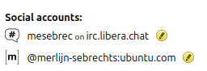

(matrix-completing-setup)=
# Completing your Matrix setup

If you are reading this guide, you most likely completed the {ref}`Getting started with Matrix <matrix-onboarding>` guide.
This document explains the next steps to complete your Matrix setup.
While these steps are not required, they are greatly recommended because they will make your long-term experience a lot better.

## Backup your encryption keys

Make sure your encryption keys are backed up.
Without encryption key backups, you might not be able to restore your end-to-end encrypted chats if you log off all your devices.

### Recovery key

* Open your Element client, click the "gear" icon, and select {guilabel}`All settings`
* Select the {guilabel}`Encryption` icon
* Navigate to the {guilabel}`Recovery` section and select {guilabel}`Set up recovery`
* Follow the on-screen instructions to generate your unique security key
* Store your unique security key in a safe place
* Ensure the button in the {guilabel}`Recovery` section now reads: "Change recovery key"

### Export keys

Optionally, you can also manually export your encryption keys:

* Navigate to the {guilabel}`Advanced` section of the {guilabel}`Encryption` settings
* Select {guilabel}`Export keys`
* Read the instructions carefully, and enter a passphrase to protect your manual encryption keys
* Download the export file and store it in a safe place

## Advertise your Matrix ID

To make sure people know how to reach you, it's best to advertise your Matrix ID in a prominent place.
Launchpad now has the option to advertise your Matrix ID on your profile.
Edit it on [Launchpad](https://launchpad.net/~/).

Make sure to always write the full matrix ID, including the homeserver, in the form `@<username>:<homeserver>`. Just specifying your username is not enough, because different people can have the same username on different homeservers.

## Further reading

* Do you have multiple Matrix accounts and want to use them at the same time? {ref}`matrix-multiple-accounts`
* Do you want to create rooms for your own community? {ref}`matrix-management`
* Do you want to know who is in charge of moderation and policy-making on our homeserver? {ref}`matrix-council`

