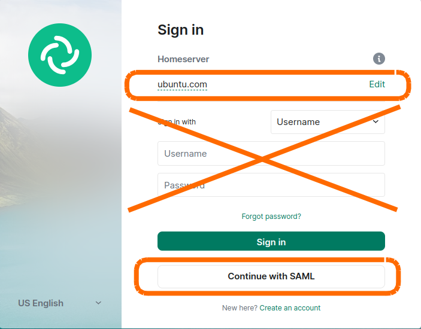

(matrix-register-ubuntu-com)=
# Register a Matrix account on `:ubuntu.com`

Ubuntu Members and Canonical employees can register a Matrix account on the `:ubuntu.com` homeserver.
By registering on `:ubuntu.com`, you receive a Matrix ID with your Launchpad nickname and the `:ubuntu.com` suffix.

To register, you need to use Element Desktop or Element Web.
For more info on how to get these, take a look at {ref}`how to install a Matrix client <matrix-get-a-client>`.

1. Start your client and select {guilabel}`Sign-in` (NOT {guilabel}`Create Account`)

1. Click {guilabel}`Edit` next to `matrix.org`

1. Select {guilabel}`Other homeserver` and type `ubuntu.com`

1. Click on {guilabel}`Continue with SAML` and log in with your Ubuntu One account.

   
    
1. After login, you'll see a page with your Matrix ID, e.g. `@username:ubuntu.com` -- press {guilabel}`continue`

1. If you are using Element Desktop, you will be asked to open the link in the application -- open Element to confirm

1. Ensure you create a secure backup of your keys, otherwise you will not be able to access your previous information and may not be able to log in


```{admonition} Username changes
:class: warning

Your Matrix ID is directly tied to your _current_ Launchpad username.
If you ever change your Launchpad username, **you will lose access** to your old Matrix account and **somebody else could take it over** by creating a new Launchpad account with your old username.

Therefore, if you ever change your Launchpad username:

1. Immediately create a new Launchpad account with your old username, to ensure the old Matrix account cannot be taken over by anyone else!
1. Add your new Matrix account to all the private rooms your old account was part of
1. Give your new Matrix account the same permissions to all the rooms
1. Remove your old Matrix account from all the rooms
```


## Next steps

* To see our public rooms, {ref}`join the Ubuntu Space <matrix-join-the-ubuntu-space>`
* Configure the app so you can {ref}`use multiple Matrix accounts <matrix-multiple-accounts>` at the same time

