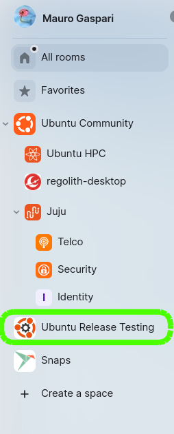

(matrix-rooms-spaces-concepts)=
# Rooms and spaces

## Matrix rooms

Chat rooms on Matrix are not exactly the same as on other platforms.
A room is created on a specific Matrix instance, but can be very easily replicated over to many other servers.

## Matrix room properties

**Internal ID**
: A Matrix room has a few basic properties that cannot be changed, such as its Internal ID (e.g., `!FHUUPIuRjbTaUxVYGa:ubuntu.com`). This internal identifier has a suffix, but that doesn't mean that the room is only on `:ubuntu.com`. Instead, the room is replicated on every server that has someone participating in it. For example, if someone with a matrix.org account joins, the same room exists on both servers at the same time and is kept in sync.

**Aliases**
: Aliases are what map a readable identifier to the room Internal ID. Each server can have their own alias for a room, so the same room can have both the alias `#room:ubuntu.com`, and `#ubuntu-room:matrix.org`. People joining through each of these IDs will not notice the difference.

: A room can have its main alias changed, or aliases added, completely transparently. Users won't need to be migrated, even if it means "moving" a room into another homeserver.

: A room is an independent item in the Matrix federated environment. Therefore, each room alias and name should be descriptive and give enough context to people that browse it or search for it. This is also true if the room is part of a space.

Public rooms should be unencrypted. There is no advantage in encrypted public room. It is not possible to search the room history or configure mentions and keywords in encrypted rooms. To {ref}`publish your public room <matrix-room-publishing>` encryption must be turned off.

## Matrix spaces

Matrix spaces are collections of rooms and/or other spaces.
However, they work in a unique way on Matrix.
A Matrix space can simply be considered a tag, a label, or a symbolic link, not a folder or sub-folder.

* Spaces can be listed under other spaces (i.e. Charmhub is listed under Ubuntu Community)
* A space or a room can be listed on multiple spaces
* A user can join a space or a room without joining any of the spaces it is listed in

{ref}`Learn more about room properties > <matrix-room-properties>`.

### Spaces on the Element client

As we established earlier, spaces are not hierarchical on Matrix, but act like symbolic links on Linux.
Or like tags or labels on an email client.
Spaces can be listed under other spaces, and the way they are displayed on the Element client depends on how many of those nested spaces a user joined.
On the left, we can see an example of a user who joined both the *Release Testing* and the *Ubuntu Testing* spaces.
In the Element client, they appear nested.
This is a design choice of the Element client, not representative of a universal hierarchy. 
On the right, the same user joined the *Ubuntu Release Testing* space but not the *Ubuntu Testing* space.
As we can see, the Ubuntu Release Testing space is now shown as a top level space in the Element client.

::::{grid} 2
:::{grid-item-card}  Both spaces are joined

:::
:::{grid-item-card}  Only one space is joined

:::
::::

