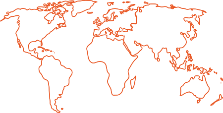

(local-communities)=
# Ubuntu Local Communities

```{toctree}
:maxdepth: 1
:hidden:

lc-create
lc-handover
lc-faq
```



Ubuntu Local Communities, often shortened to LoCos, are regional teams that help advocate, promote, translate, develop and otherwise improve Ubuntu. 

With the incredible success of Ubuntu around the world, the Ubuntu Local Communities program was formed to help Ubuntu fans and enthusiasts work together.  Our worldwide network of LoCo teams are an important staple in the Ubuntu ecosystem and provide a strong backbone to our already vast and extensive Ubuntu community.


## What are the perks of being in an Ubuntu Local Community?

* Network with other Ubuntu enthusiasts in your region.
* Access to exclusive Ubuntu Merch Packs and swag.
* Future event sponsorship opportunities.
* Participation may lead to future {ref}`ubuntu-membership`.
* Help spread the mission of free and open source software around the world!


## How to join an Ubuntu Local Community

Becoming part of an Ubuntu Local Community is a great way to meet other passionate Ubuntu enthusiasts in your community. Find a team in your area to join by checking out the [Ubuntu Local Community Teams](https://ubuntu.com/community/locos/join) Directory.


## How to create an Ubuntu Local Community

Can’t find a team in your area? You may want to consider starting one! Learn how you can {ref}`Create an Ubuntu Local Community <lc-create>`.


## Join in the Ubuntu Local Community conversation

Do you have other Ubuntu Local Community related questions or want to help shape the future of the program? Engage with other LoCo leaders and advocates in the [Ubuntu LoCo Discourse](https://discourse.ubuntu.com/c/locos/129).
