(error-tracker)=
# Error tracker

```{admonition} Migrated content
This page has been migrated from the Ubuntu Wiki "as is".
It may contain inaccuracies, may not be up-to-date, and may require
formatting, language, or other corrections.
```

Ubuntu’s error tracker explains crashes, freezes, and other severe errors to end users; lets them report an error with the click of a button; and collects these reports from millions of users to show Ubuntu developers [which errors are most common](https://errors.ubuntu.com/). It’s all open source, and **you can help**. You can find the errors your computer has reported to the error tracker via System Settings, Security & Privacy, Diagnostics, Show Previous Reports.


(rationale)=
## Rationale

To help Ubuntu reach a standard of quality similar to competing operating systems, developers need to know the answers to two questions:

1. **How reliable is Ubuntu right now?** (Compared with yesterday, compared with the previous version, or compared with what it would be if everyone had installed every update.)

 2. **What’s the best thing I can do right now to help improve its quality?**

We can better answer both of those questions if we collect **all the information we need**, for as **many types of problems** as we can, from **a large representative sample** of people. This means not requiring people to sign in to any Web site, enter any text, submit hundreds of megabytes of data, receive e-mail, or do anything more complicated than clicking a button. It means collecting problem reports both before and after release. And it means analyzing and bucketing problems automatically, with developers able to configure the system to automatically retrieve more information about a particular kind of problem when it next occurs.

Statistics collected by Microsoft show that a bug reported by their Windows Error Reporting system “is 4.5 to 5.1 times more likely to be fixed than a bug reported directly by a human”, that fixing the right 1 percent of bugs addresses 50 percent of customer issues, and that fixing 20 percent of bugs addresses 80 percent of customer issues.

The client interface for the error tracker also serves a purpose which is less important for developers, but *more* important for end users: **explaining why something weird just happened**. In previous Ubuntu release versions, when most programs crashed there was no explanation of why the window had disappeared.


(client-design)=
## Client design


(settings)=
(privacy-settings)=
### Privacy settings

_Compare [the equivalent screen in the installer](https://docs.google.com/document/d/1bZ4yQIVgGaUGSYu3qiUHnQt3ieBZoqunP_DcleHCr3I/edit#heading=h.3qe17agyh876).

The System Settings “Security & Privacy” panel should contain a “Diagnostics” section for error and metrics collection. (While `gnome-control-center` has a “Privacy” section using a list-and-dialogs model, instead of being a tab, “Diagnostics” should replace the “Problem Reporting” dialog.)

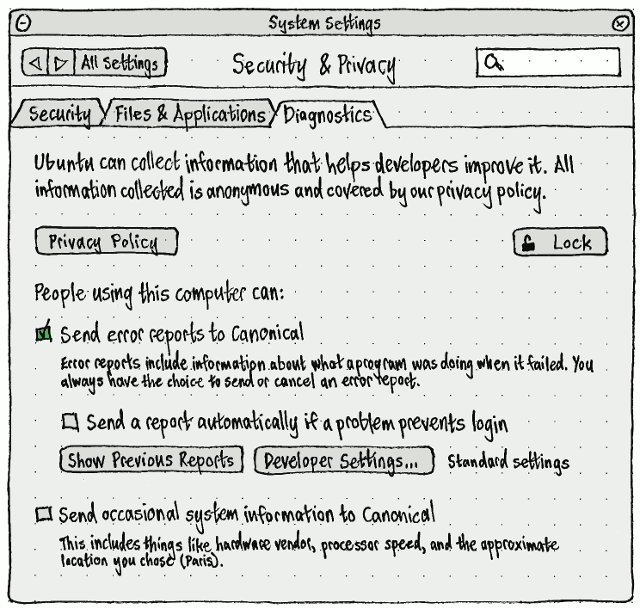

“Privacy Policy” should open a browser window to the privacy policy.

The “People using this computer can…” and following controls should be disabled whenever you have not unlocked them as an administrator.

The diagnostics checkbox caption — “This includes things like hardware vendor, processor speed, and the approximate location you chose (%n).” — should include that location to reassure you that it is sending only a city reference, not a precise latitude and longitude.

(settings-developer)=

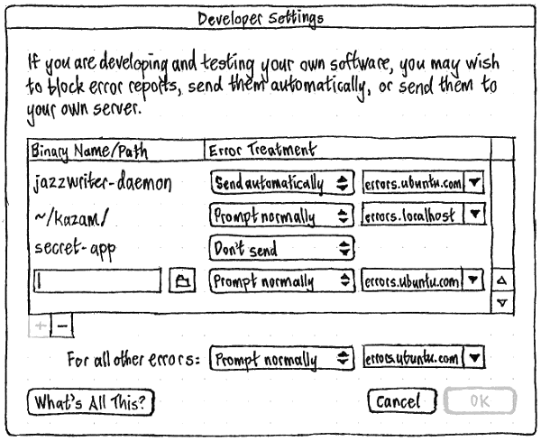

Choosing “Developer Settings…” should open a secondary “Developer Settings” dialog for specifying exceptions to the usual error handling. If any exceptions are currently set, that “Developer Settings…” button should have “Customized” next to it in small print.

By default the list of exceptions should be empty. The “+” button (with accessible label “Add”), and the “OK” button, should be insensitive only if you are already currently adding an exception and its path value is currently invalid (non-existent or duplicate). For each exception you add, the default name/path value should be “~/” unless there is already an exception for that path, since that’s the most likely single value (for excluding or special-casing all binaries you build yourself).

Each “Error Treatment” menu should have three items: “Prompt normally” (the default), “Send automatically”, and “Don’t send”. Whenever either “Prompt normally” or “Send automatically” is chosen, an adjacent combo box should be present. Its menu should list “errors.ubuntu.com” followed, in alphabetical order, by any other error servers you are currently using.

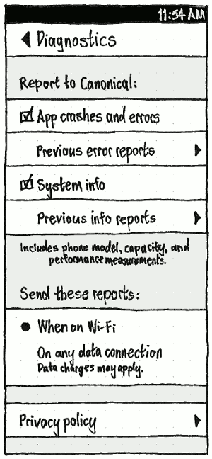

On the phone, all the checkboxes should be checked by default. In a new Ubuntu PC installation (or an upgrade to a version that introduces these settings), “Send error reports to Canonical” should be checked by default. But “Send a report automatically if a problem prevents login” and “Send occasional system information to Canonical”, when present, should be unchecked by default.

(Error reports are also [accessible to trusted Ubuntu developers](https://lists.ubuntu.com/archives/ubuntu-devel-announce/2013-May/001039.html) who are not employed by Canonical. This is covered in the privacy policy.)

The “When on Wi-Fi” and “On any data connection” radio items and caption (bug Bug:1320973) should have exactly the same wording and order as [in the “Updates” settings](https://wiki.ubuntu.com/SoftwareUpdates#settings-phone), but be an independent setting.

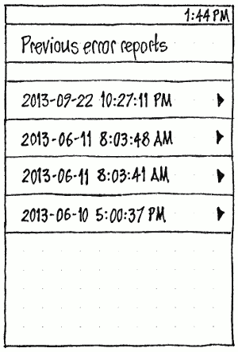

The “Previous error reports”, “Previous info reports”, and “Previous Wi-Fi reports” screens should all consist of a chronological list of reports, latest first, each labelled by its timestamp. The screen for each report should have that timestamp as its header, and consist entirely of a frame of wrapped selectable and copyable text.


(error)=
(when-there-is-an-error)=
### When there is an error

**Silent error types** are types of error for which users should not be notified. They consist of:

* Errors that occur during logout/shutdown.

* Any error that occurs over a minute before the error alert could appear, where you have interacted with the session during that interval (bug Bug:1018117). For example, if a CPU-intensive application task crashes while you aren’t using the computer, when you return to the computer you should still see an explanation of why the program has disappeared, regardless of how long that explanation took to appear. But if you were using the computer at the time, you are likely to have noticed the error long before the alert would appear, so the alert would seem like a non-sequitur.

When there is an error that prevents login, and “Send a report automatically if a problem prevents login” is checked, the error should be sent automatically.

Otherwise, if the error is not of a silent type, an alert should appear with controls depending on the situation.

(multiple)=

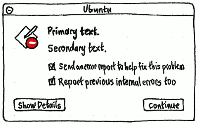

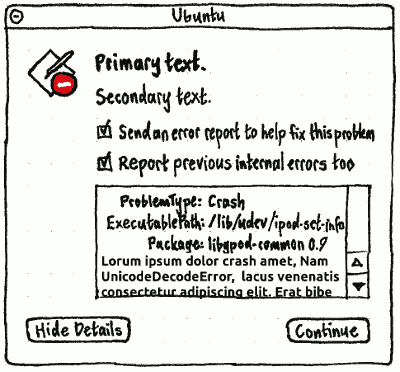

The “Report previous internal errors too” checkbox should be present if any errors of silent types have occurred since the last time a non-silent error was presented. Whenever it is checked, the details field should show details of all the errors, with separators between them.

If your admin has blocked error reporting, neither the “Send an error report to help fix this problem” nor “Report previous internal errors too” checkboxes should be present. If they are present, they should be checked by default in a new Ubuntu installation, and their state should persist across errors and across Ubuntu sessions.

(comments)=
If you choose “Show Details”, it should change to “Hide Details” while the details field appears above the buttons. If necessary, a spinner and the text “Collecting information…” should appear centered inside the details field while the information is collected (other than the process name and timestamp, which should appear instantly), pausing whenever the collection system is waiting for you to answer any questions. If no details are available (for example, the crash file is unreadable), below the timestamp and (if available) the process name should appear the paragraph “No details were recorded for this error.” Regardless, the field contents should end with the paragraph “Other information may be sent if Ubuntu developers request it.”

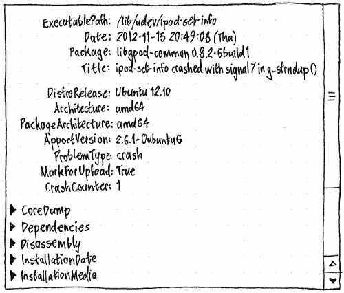

Unless otherwise specified, an error alert should have a “Continue” button opposite the “Show Details”/“Hide Details” button. The Esc and Enter keys should *not* do anything in an error alert, because you may have been just about to press one of those in the program that has the problem.

(error-types)=
| Error type | Test case | Icon | Primary text | Secondary text | Custom elements | Implemented in Ubuntu |
| :--- | :--- | :--- | :--- | :--- | :--- | :--- |
| **An application crashes** | `eog & pkill -SEGV eog` | App icon with error emblem | The app {Name of App} has closed unexpectedly. | — | "Leave Closed" and "Relaunch" buttons, instead of the "Continue" button. | 12.04 |
| **An application has a developer-specified error** (Recoverable Error) | | | The app {Name of App} just had a bit of a problem. | {Developer-specified error text} | — | 12.10 |
| **An application is hung for at least 30 seconds** | `eog & sleep 5 && pkill -STOP eog && sleep 20 && pkill -CONT eog # then wait for 30 seconds` | | The app {Name of App} has stopped responding. | — | "Force Closed" and "Relaunch" buttons, instead of the "Continue" button. The alert should also be modal to the unresponsive window, and should therefore have no title of its own. (It appears much later than, because it is more intrusive than, the greying-out of the window after 5 seconds.) If that window becomes responsive again, the alert's contents should become insensitive for one second (to block misclicks) before the alert closes (and in the latter case, the window closes too). | (targeted for 13.10) |
| **An application is hung for at least 5 seconds after you try to close its window** | `eog & sleep 5 && pkill -STOP eog & pkill -TERM eog && sleep 5` | | Hmm, this window isn't closing because {Name of App} has stopped responding. | — | | (targeted for 13.10) |
| **An application thread crashes** | | | The app {Name of App} just had a problem. | If you notice things aren't working properly, try closing then relaunching the app. | An "Ignore future errors of this type" checkbox, *if* this is not the first error in this version of this package on this machine, *and* there is no "Report previous internal errors too" checkbox (so that we don't show more than two checkboxes at once). | (in 12.04 and 12.10, shows "closed unexpectedly" error instead, bug Bug:1033902) |
| **Third-party non-application software crashes** | `sh -c 'kill -SEGV $$'` | Generic package icon with error emblem | The program "{name of executable}" has stopped unexpectedly. | — | | 12.04 |
| **An OS package crashes** (including kernel oopses) | `sudo pkill -SEGV zeitgeist` | Error tracker icon | Sorry, this computer just had a bit of a problem. | If you notice things aren't working properly, try restarting the computer. | | 12.04 |
| **Ubuntu restarts after a kernel crash** | | | Ubuntu has restarted after an internal error. | — | — | (targeted for 12.04 SRU, bug Bug:1051891) |
| **A package fails to install or update** | | Generic package icon with error emblem | Sorry, a problem occurred while installing software. | Package: {package name} {version} | — | (targeted for 12.04 SRU) |

If you choose to send an error report, the alert should disappear immediately. Data should be collected (if it hasn’t been already), and reports should be sent in the background, with *no* progress or success/failure feedback. If you are not connected to the Internet at the time, reports should be queued. Any queued reports should be sent when you next agree to send an error report while online.

If you are using a pre-release version of Ubuntu, and the error report matches an existing Launchpad bug report, a further alert box should appear explaining its status and letting you open the bug report.

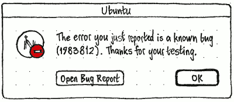

**Future work:** Ensure that if there is a delay in displaying a crash, we adjust the text of the dialog to reflect this. As an example, if X crashes and the user has to log in again or reboot the computer.

**Future work:** If a software update is known to fix the problem, replace the primary alert with [the software update alert](https://wiki.ubuntu.com/SoftwareUpdates#alert) (or progress window, depending on the update policy), with customized primary text.  Or point them at a web page (not a wiki page!) with details if a workaround exists, but no fix is available yet.

**Future work:**  Automate the communication with the user to facilitate things like leak detection in subsequent runs, without requiring additional interaction with the user.  Our current process requires us to ask people who are subscribed to the bug to try a specially-instrumented build, with a traditionally very long feedback loop between the developer and the bug subscribers.  We should make it entirely automatic.  Just wait for the next user who sees the bug to click one "yes, I'd like to help make this product better" button.


(memory)=
(when-there-is-not-enough-memory-for-a-core-dump)=
### When there is not enough memory for a core dump

When the kernel does not have enough memory, an error report should still be sent (or queued for sending) as normal for accounting purposes, just without the core dump.


(updates)=
(when-an-update-is-available-to-fix-a-crash)=
### When an update is available to fix a crash

When a crash (whether of an application or OS package) occurs, “Send error reports to Canonical” is checked, and Ubuntu hasn’t previously submitted this particular crash signature, it should send a basic crash signature to the server.

If it does not do this, *or* within five seconds it does not receive a response that the problem is fixed by a software update *and* it did not know from a previous submission that it is fixed by a software update, then the error alert should appear as normal.

Otherwise, the usual error alert should change:

* the secondary text should be “The good news is, a software update is available to fix this problem.”

* the checkbox label should be “Send an error report anyway”.

* An extra “Install Updates…” button should be present on the leading side of the trailing group (even if you are not an admin).

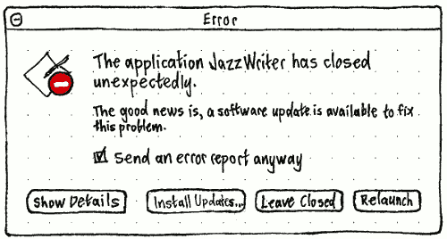

Choosing “Install Updates…” should [launch Software Updater](https://wiki.ubuntu.com/SoftwareUpdates#launch-manual) (leaving the application closed, if it was an application crash).

_We also considered changing the Software Updater UI to appear unprompted sooner, or to have custom text, when updates are known to fix problems users on your system have submitted. We decided against it because it would be less obvious.


(debconf)=
(when-there-is-a-debconf-prompt)=
### When there is a debconf prompt

debconf prompts for user-installed software in Ubuntu are, overwhelmingly, programming mistakes. Therefore, they should be presented as error alerts.

**Implementation:** See [/Contributing/Debconf](https://help.ubuntu.com/community//Contributing/Debconf) for instructions on how to work on these alerts.

**A Debconf prompt**

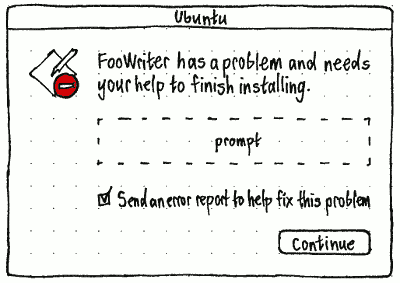

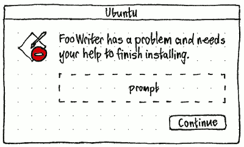

(targeted for 13.10 — [how to contribute](https://wiki.ubuntu.com/Contributing/Debconf))

If the `TITLE` command is used, that string should be used as the title of the window instead of “Ubuntu”.

The primary text should depend on the type of package and the situation:

| | Application | Non-application package |
| :--- | :--- | :--- |
| During installation | {Application Name} needs your help to finish installing. | The package "{package name}" needs your help to finish installing. |
| During [postinst abort-remove](http://www.debian.org/doc/debian-policy/ch-maintainerscripts.html#s-removedetails) | {Application Name} needs your help to finish its removal. | The package "{package name}" needs your help to finish its removal. |

Controls should be included in the alert depending on the type of prompt.

(debconf-string)=
**Type “string”**


(debconf-boolean)=
**Type “boolean”**


(debconf-select)=
**Type “select”**


| If there are six or fewer choices: | If there are more than six choices: |
| :--- | :--- |

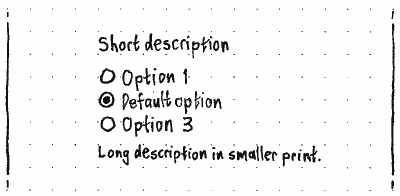

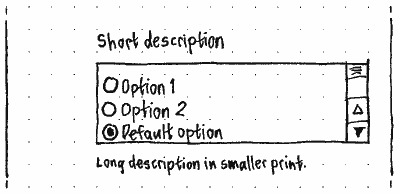

(debconf-multiselect)=
**Type “multiselect”**


| If there are six or fewer choices: | If there are more than six choices: |
| :--- | :--- |

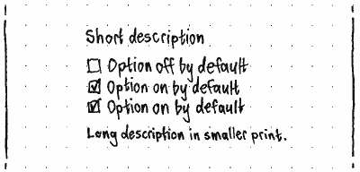

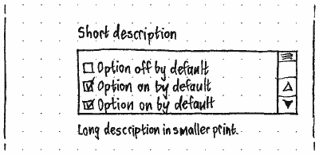

(debconf-note)=
**Type “note”**

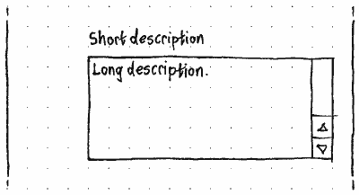

(debconf-text)=
**Type “text” or “error”**

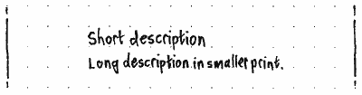

(debconf-password)=
**Type “password”**

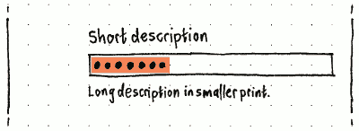

(debconf-progress)=
(presenting-debconf-progress)=
#### Presenting debconf progress

_This has nothing to do with error tracking, but is included here because the error tracker provides all the rest of debconf’s graphical UI.

When a maintainer script requests progress presentation (`db_progress`), the progress text and proportion should be shown in a progress window. Ideally, this progress window should morph to and/or from any consecutive debconf prompts.

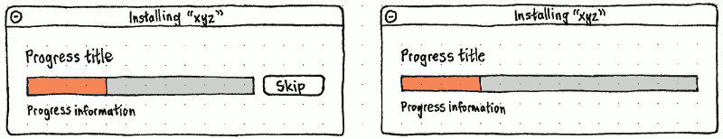

The window title should be of the form ‘Installing “package-name”’, ‘Reinstalling “package-name”’, ‘Updating “package-name”’, or “Removing ‘package-name’” as appropriate, or “Ubuntu” if the type of operation is unknown. The “Skip” button should be present if the operation is skippable.


(metrics)=
(invitation-for-metrics-collection)=
### Invitation for metrics collection

For any administrator, after the *first* time only that they respond to an error alert, a second alert should appear to invite them to opt in to metrics collection. (The “Esc” key should activate “Don’t Send” in this alert, but the “Enter” key should not do anything.)

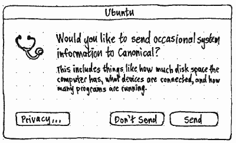

The “Privacy…” button should open System Settings to the Privacy panel. Choosing “Send” should be equivalent to checking “Send occasional system information to Canonical” in the Privacy settings.


(previous)=
(accessing-previous-reports)=
## Accessing previous reports

Choosing “Show Previous Reports” in **the settings interface** should open a Web page listing those reports.

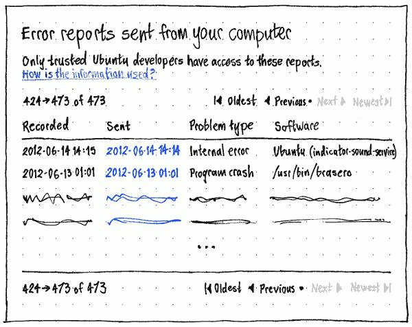

_Erratum: “Recorded” and “Sent” should be “Occurred” and “Received”.

To avoid end users getting lost in developer material, the page should have no global navigation.

To avoid privacy problems, it should be impossible to share the URL of the page. *How?*?

Error reports should be listed in the order they were received, newest first, defaulting to the newest 50. The date received should link to the individual report.

If there are from 1 to 50 reports, the batch count should read only “Showing all {number}”, and there should be no batch navigation.


If there are no reports at all, there should be no batch count, navigation, or table — just an explanatory sentence.

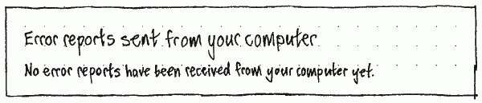

(client-implementation)=
## Client implementation

The apport client will write a .upload file alongside a .crash file to indicate that the crash should be sent to the crash database.  A small C daemon (currently "whoopsie", previously "reporterd") will set up an inotify watch on the /var/crash directory, and any time one of these .upload files appears, it will upload the .crash file.  It will do this if and only if there is an active Internet connection, as determined by watching the NetworkManager DBus API for connectivity events, otherwise it will add it to a queue for later processing.

We will ensure NetworkManager brings up the interfaces as early as possible, to enable us to file crash reports during boot.

This needs to be a daemon, rather than another path of the apport client code, to account for there not being an Internet connection at the time of the crash and for crashes during boot, when we cannot assume the user will get back to a known-good state to file the report.

The canonical example here is the scenario posed in Microsoft’s Windows Error Reporting paper, where a piece of malware was causing the core desktop application (explorer.exe) to crash.  They were still able to receive crash reports, as their client software still submitted reports very early on in the boot process.

The apport crash file will be parsed into an intermediate data structure (currently a GHashTable), with the core dump stripped out, and then converted into BSON to be transmitted in a HTTP POST operation.  The server will reply with a UUID for subsequent operations and, optionally, a command for further action.  Initially, this will just be a command to upload the core dump.

A new field is being added to the apport crash file, StacktraceAddressSignature. The server will check for this field, and if it already has a retraced core dump generated from the same signature, it will reply with just the UUID of the crash report entry in the database, indicating that a core dump need not be submitted.

If, however, the server does reply with a request to upload the core dump, it will be sent as zlib compressed data in an HTTP POST operation.

The URLs for posting will be of the form:

 - [http://crashes.ubuntu.com/submit](http://crashes.ubuntu.com/submit)

 - [http://crashes.ubuntu.com/550e8400-e29b-41d4-a716-446655440000/submit-core](http://crashes.ubuntu.com/550e8400-e29b-41d4-a716-446655440000/submit-core)

Crash reports will be cleaned up after 14 days, as the system may never be connected to the Internet.

If the reporter daemon crashes, it will write a crash file like any other application.  Its upstart job will have the respawn flag set, and a limit put in place so it doesn't go crazy.

If the reporter daemon moves to using apport-unpack to process the crash files, it should gracefully handle -ENOSPC.

Crash reports for applications not themselves part of packages in the Ubuntu will be handled.  These will not be retraced, but they will be collected for statistical analysis.  This removes the "the problem cannot be reported" dialog in Apport.

We will add an Origin and possibly a Site field to the apport reports, using the python-apt candidate.origins interface. This will allow us to answer questions like what percentage of crashes are coming from PPAs. More importantly, it will let us focus reports on packages from a particular PPA, like the unity-testing one.


(click-packages)=
(click)=
### Click

We will build a symbol server, possibly adapting Fedora's [Darkserver](http://fedoraproject.org/wiki/Darkserver). Access to all the data from proprietary applications on the symbol server will be granted to our retracers, but will be restricted for developers looking to retrace crashes locally. This will likely leverage the Ubuntu One SSO API as it is used in MyApps. For non-proprietary applications, no access control will be necessary. All symbols will be associated with an application for ACL tracking and garbage collection.

Support will be added to the SDK for symbol extraction and submission. In the case of extraction this will likely take the form of a 'click strip' subcommand which will walk a tree and produce a set of debug symbols (e.g. in hashed /usr/lib/debug style). This will be integrated into QtCreator.

Apport will be taught how to talk to the symbol server for retracing. Daisy will also require minimal changes to its retracer code and configuration to support this.

We will add a set of APIs for collecting per click-version problem data for MyApps to consume and display. This will be simple at first, largely focusing on tracking versions, problems per version and their counts, and instances. Over time it will grow more complex graphing data and problem information. It will need to be protected or blocked from outside MyApps as it will expose stacktraces and other sensitive crash data.

The problems for proprietary applications and their rank will be made visible on the leaderboard as a means of keeping everyone honest.


(error-rates)=
(calculating-daily-error-rates)=
## Calculating daily error rates

The **daily error rate**, for an individual machine with Ubuntu installed, is the number of errors it reports that calendar day.

We have no way of knowing how many machines have Ubuntu installed. And here that wouldn’t be interesting anyway, because many active Ubuntu machines don’t report any errors they do have. Maybe they have error reporting turned off, or maybe they are behind a firewall.

So the average daily error rate across all machines is *not* the total number of errors reported, divided by the total number of machines with Ubuntu installed. Instead, it is the total number of errors reported, divided by the number of machines that *would* report errors today, if they encountered any.

We don’t know that number of machines exactly, either, because machines don’t ping us to say “I would have reported errors today, but I just didn’t have any”. So we have to estimate the number of reporting machines, and all we have to go on is our counts of machines that reported errors in the past. To make this more accurate, we do two things: ramping up newly-reporting machines, and damping down no-longer-reporting machines.

**Ramping newly-reporting machines** is necessary because on release days (and the weeks before), we get the first error report from a relatively huge number of new installations, without knowing how many new error-free installations have also come online (bug Bug:1069827). If we did not compensate for this, the error rate would appear to spike on release day, and even climb in the weeks before. So the weighting of that machine should be whichever is lower: 1, or the number of days since its first error report divided by a constant. Currently [the constant is 90](http://bazaar.launchpad.net/~daisy-pluckers/daisy/trunk/view/head:/daisy/constants.py#L20).

**Damping no-longer-reporting machines** is necessary because a computer that used to report errors might have had Ubuntu removed from it, or it might have been lost at sea, or it might have fallen into a volcano, or it might have been sold to someone who doesn’t believe in error reporting. If we kept counting it forever, the error rate for every release would appear to approach zero. So, starting from the day of a machine’s latest error report, the machine’s weighting should decline based on the probability that it would have reported any errors that it experienced today. That probability should be based on past performance for all machines that have ever reported errors (bug Bug:1077122).

For example, if Machine A reported its first error at least 90 days ago, and its most recent error today, its weight should be 1.0, because it did indeed report any errors that it experienced today. If Machine B reported its first error at least 90 days ago, and its most recent error a month ago, and 12 percent of machines that last reported a month before the current date go on to report again, Machine B’s weight should be 0.12. And if those were the only two machines that had ever reported errors, our count of **weighted active machines** for today would be 1.12.

This finally gives us the **average daily error rate** — the number of error reports received that day, divided by the count of weighted active machines for that day.

One problem that isn’t solved by these adjustments: Counting calendar days is misleading. For example, the current error rate for Ubuntu 12.04 is higher on weekdays than in weekends, almost certainly because it’s used on more machines for longer periods during weekdays (bug Bug:1046269).


(comparisons)=
(cross-release-comparisons)=
### Cross-release comparisons

So that we can make fair comparisons of reliability between Ubuntu releases, both the client and the server should track whether each reported error is of a kind that *would* have been reported if it had occurred in each past Ubuntu release.

For example:

* **When there is not enough memory for a coredump**, the error is not recorded in 12.04 or 12.10, but is recorded in 13.04 and later. So errors of that type should be excluded from by-12.04-standards measurements.

* Errors in binaries mentioned in `/etc/apport/blacklist.d` are not counted in 12.04 or 12.10 (bug Bug:1064395).


(server)=
(errors-ubuntu-com)=
## errors.ubuntu.com


(graphs)=
### Graphs

Many pages on the site should feature a graph of the error rate for applicable errors and Ubuntu versions.

The X axis of the graph does not need a label (because dates are obvious enough). It should begin at the start of the development cycle for the applicable series. It should end whichever is later:

* the release date of that/those series (so you can see time remaining for improvement before release), or

* whichever is earlier:

* today, or

* the (last) EOL date for that/those series.

The Y axis of a graph should have the label “Errors per machine per 24 hours” (or “Errors per machine per calendar day” until bug Bug:1046269 is fixed). It should begin at zero, and end at whichever is less: 0.40, or a sensible round number above the maximum value showable, even if it is currently hidden. (For example, temporarily hiding the Ubuntu version with the highest error rate should not cause the axis to zoom in for the remaining versions.)


(front-page)=
#### Front page

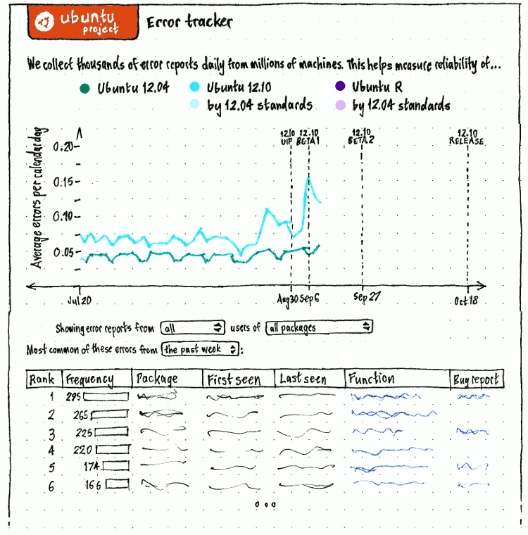

By default, the front page should begin with a graph for nearly all dates (bug Bug:1053410) and all Ubuntu versions from which errors were recorded — including **cross-release comparisons** “by 12.04 standards” vs. “all collected” for post-12.04 versions. (More comparisons may be added later.)

Once at least six months of data has been recorded, the main graph should be followed by a thumbnail navigation graph for selecting a date range. If you do this, the filter controls for the table should change to the same date range, though the reverse should not happen (entering a date range by date should not change the main graph).

(filters)=
Next should be controls for changing the graph and the table. A spinner should appear at the trailing end of the first row whenever the graph and/or table are being updated.

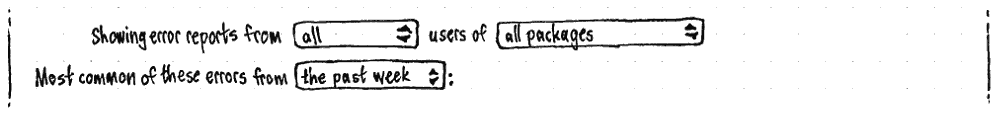

The “Showing error reports from” menu should begin with an item for “all” (the default), then “Ubuntu {development version}”, then tracked released versions from newest to oldest. For example, “all”, “Ubuntu S”, “Ubuntu 13.04”, “Ubuntu 12.10”, “Ubuntu 12.04”.

The “users of” menu should contain items for “all packages” (the default), “the package:”, “-proposed”, “ubuntu-desktop”, any other useful package sets, and “packages subscribed to by:”.

Whenever the menu is set to “the package:”, it should be followed by a text field for entering the package name (auto-converted to lower case), and a menu containing items for “all versions” plus versions of the current package. (The spinner should appear whenever the list of versions is populating.)


Whenever the menu is set to “packages subscribed to by:”, it should be followed by a text field for entering a Launchpad ID (with any tilde automatically filtered out) or the URL of a valid Launchpad profile. The default value should be the last value entered from this browser if known, otherwise your own Launchpad ID if you are signed in, otherwise empty.

**TODO**: What happens when a user is entered that does not exist?

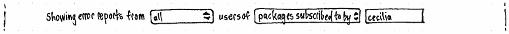

For either field, the graph and table should be updated whenever the field’s contents changes to a new valid value, and either you press Enter or the field loses focus.

(date-range)=
The date menu should control the contents of only the table, not the graph. It should have items for “the past day” (the default), “the past week”, “the past month”, “the past year”, and “the date range”. Whenever “the date range” is selected, date fields should appear alongside for specifying the date range. If you have never used these before, they should default to the past year. Otherwise, they should remember whichever dates you used last.


Finally, the table should appear.

For both the graph and the table, whenever one of them is loading, is interactively updating, or failed to load, it should be semi-transparent. If the table fails to load or update, an error message should also appear alongside the table filter controls if there is room, or below them otherwise: an error icon, the text “Sorry, the table data didn’t load.”, and a “Retry” button (bug Bug:1060037).


(bucket-page)=
#### Bucket page

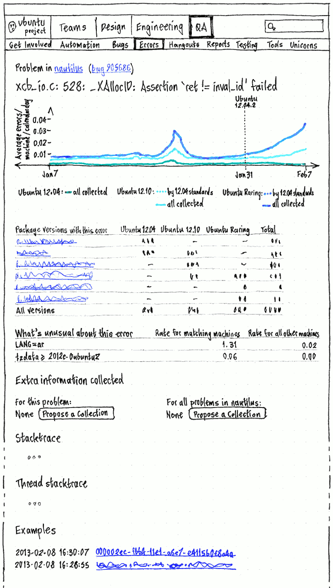

_Erratum: The “By _ standards” lines should not be present, because a single problem type either occurs in that release or it doesn’t.

The bucket page, showing a collection of errors with the same cause, should contain:

1. The text “Problem in {name of package}”, where the package name links to the Launchpad page for that package (if there is one), otherwise the MyApps page for that package (if there is one).

1. A link to the associated bug report, if there is one, otherwise a “Create Bug Report” button.

1. The error signature.

1. A graph of “Average errors / machine / calendar day” for this error (bug Bug:1086850).

1. A table of “Package versions with this error” per Ubuntu release (bug Bug:1078801).

1. A “**What’s unusual about this error**” table (once it is implemented).

1. An “**Extra information collected**” section (once it is implemented).

1. A “Stacktrace” section.

1. A “Thread stacktrace” section.

1. An “Examples” table, with an infinitely scrolling table of examples of this error, most recent first (bug Bug:1084626). This table should have columns for “Time”, “Example”, “Package version”, and “Ubuntu version”.


(unusual)=
(what-s-unusual-about-this-error)=
##### “What’s unusual about this error”

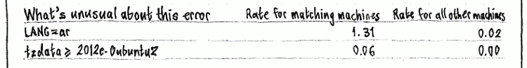

The “What’s unusual about this error” table should list those variables for which there is the greatest difference (in descending order) between error rate for known machines with one value, and error rate for known machines with all the other values put together.

*How?* do we guard against individual reporting machines that happen to have a unique value of some variable?

Variables should include things like versions of other packages, that another package is installed at all, locale settings, whether the system is an upgrade or a fresh install, [timezone](https://bugs.launchpad.net/apport/+bug/1196992), and day of the week.

[May 29th, 2013 discussion](http://paste.ubuntu.com/5713702/)
[June 25th, 2013 discussion](http://pastebin.ubuntu.com/5798639/)


(extra-info)=
(collecting-extra-information-for-particular-errors)=
## Collecting extra information for particular errors

The “Extra information collected” section on a bucket page should have two columns: “For this problem:” and “For all problems in {package name}:”.


For either type, whenever there are no hooks, this should be shown with the text “None” and a “Propose a Collection” button. Clicking it should sign you in and return you to this part of the page, if necessary, then reveal a form for “Proposing a collection”.

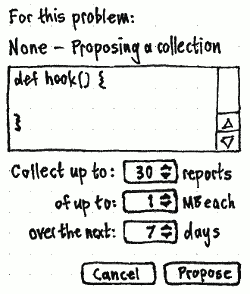

→

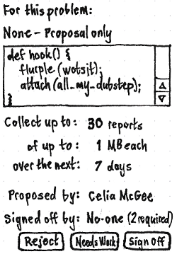

→

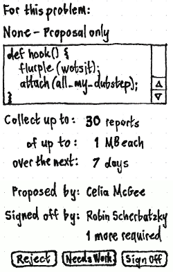

→

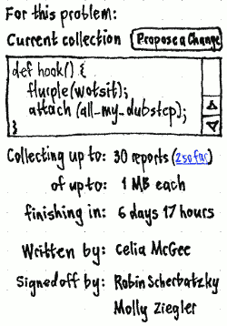

Once anyone has entered an apparently valid hook and chosen “Propose”, the hook field should become read-only and the parameter fields should become static text, with “Proposed by:” and “Signed off by:” data appearing below.

The “Reject” and “Needs Work” buttons should be sensitive for anyone signed in with permission to review hooks, and the “Sign Off” button sensitive for any of those people except the initial submitter and someone who has already signed off on this hook.

Once a hook is approved, the “Collecting up to:” line should include a link of the form “3 so far” to the data collected from this hook so far, and “over the next: {duration}” should change to “finishing in: {duration remaining}”.

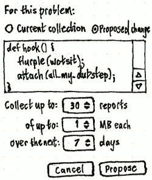

If you choose “Propose a Change”, or anyone has submitted a change proposal that has not yet been rejected or signed off, the collection form should begin with radio buttons “Current collection” and “Proposed change”, letting you flip between the hook code *and* other parameters for the current hook vs. the proposed one.


(server-architecture)=
## Server architecture

[/ServerArchitecture](https://help.ubuntu.com/community//ServerArchitecture) has additional details.


(contributing)=
(how-you-can-help)=
## How you can help

There are a few components to the error reporting system. To understand where to make your contribution, first understand how all the pieces fit together.


(anatomy-of-a-crash)=
### Anatomy of a crash

When an application crashes in Ubuntu, apport is called and a basic crash report is written into the `/var/crash` directory. This initial report contains the information that can be gathered quickly, such as the date and path to the application.

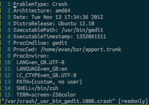

Meanwhile, another program called update-notifier is watching the `/var/crash` directory for new files. It sees that a .crash file has been created and runs Apport with this file as an argument. The following window then appears:

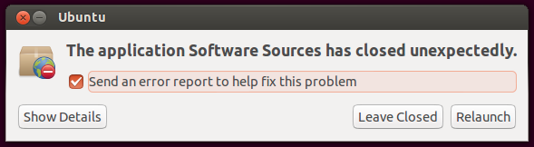

This is the first contact the user has with the issue since the application that crashed disappeared from view. At this point additional information is collected for the report. This occurs either when they press “Show Details”, so that these details may be presented to them for review, or when they dismiss the dialog with the “Send an error report to help fix this problem” box checked.

The additional details collected will be ones that could not be calculated quickly when the report was first created. As one example, the packages that this application depends on and their versions will be determined and written into the report.

When the user dismisses the dialog with the “Send an error report to help fix this problem” box checked, another file is created in the `/var/crash` directory with the same name as the crash report, but with a .upload extension. This file has no contents. It is just used as a signal to the program responsible for uploading the crash report that the user wants this report sent.

This program responsible for uploading crash reports is called Whoopsie. It’s always running on Ubuntu systems, watching the `/var/crash` directory for files ending in .upload. When it sees one of these, it checks to see if there’s a high-speed internet connection. If it cannot find one, it waits to send the report until later. Otherwise, it opens the matching .crash file and converts it into [binary JSON](http://bsonspec.org/) data then sends this information to [http://daisy.ubuntu.com](http://daisy.ubuntu.com).

Along with the report, Whoopsie sends an obfuscated (SHA512) system identifier (DMI system UUID). This information is collected so that we can show a graph of the average errors per calendar day. It also lets us answer questions like, “is Ubuntu more stable in the first week of use or subsequent weeks?”

The servers responsible for [http://daisy.ubuntu.com](http://daisy.ubuntu.com) receive these error reports, about 80,000 per day currently, and write them into a large Cassandra database.

Once the report is written into the database, it’s put through a process called “bucketing.” This takes the report and determines what makes it an instance of a larger problem. In its simplest form, this is a string that contains the path to the program that crashed, [the signal](http://en.wikipedia.org/wiki/Unix_signal) that occurred, and the top few frames of the stack trace, all separated by colon characters:

```text
/usr/bin/update-notifier:11:g_object_ref:g_list_foreach:get_mounts:get
```

Every time a crash is received, it is grouped with the other crashes that produce this same “crash signature.” We call this grouping a problem, or bucket. Every time a new crash is added to one of these buckets, a counter for the bucket is incremented for the date, month, and year that the crash was seen. This is how we identify what the most important problems in Ubuntu are: we present a table on [http://errors.ubuntu.com](http://errors.ubuntu.com) of the buckets with the most number of instances:

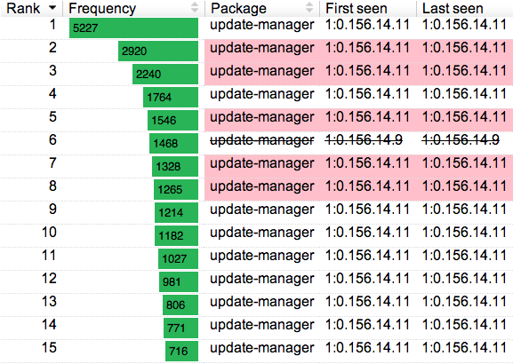

(anatomy-of-a-crash-in-detail)=
### Anatomy of a crash, in detail

```text
apport -> whoopsie -> daisy.ubuntu.com -> errors.ubuntu.com
```

1. Apport is called by the kernel's [core pattern handler](http://www.kernel.org/doc/man-pages/online/pages/man5/core.5.html) and creates a [report file](http://people.canonical.com/~pitti/doc/apport-data-format.pdf) in `/var/crash`.

 2. The `update-notifier` application watches for changes in `/var/crash`. It sees this newly written report file and calls `/usr/share/apport/apport-gtk`.

 3. Apport displays a [graphical dialog](https://wiki.ubuntu.com/ErrorTracker#When_there_is_an_error) asking the user if they want to report the issue.

 4. If the user chooses to report the issue, a `.upload` file is created in `/var/crash`. The `whoopsie` application is watching `/var/crash` for these. It waits until there is an active Internet connection, then finds the matching report for the `.upload` file, and uploads it to [https://daisy.ubuntu.com](https://daisy.ubuntu.com).  After the successful upload whoopsie creates a `.uploaded` file in the same directory.

 5. Crashes come in two parts. There's the metadata associated with the crash (date, environment variables, Ubuntu release, ...) and the crash itself. This latter part is called a [core dump](http://en.wikipedia.org/wiki/Core_dump) and is often very large. In order to avoid requiring everyone submitting a crash to also submit a core dump, we use a first pass signature called a [StacktraceAddressSignature](http://bazaar.launchpad.net/~apport-hackers/apport/trunk/view/head:/apport/report.py#L1237). There may be a few `StacktraceAddressSignatures` for any `CrashSignature`.

 5. Daisy accepts these uploaded reports from users and writes them into a Cassandra database. If it has not yet received a core dump for this problem (checking the aforementioned `StacktraceAddressSignature`), then it replies to whoopsie asking for one.

 6. If requested, `whoopsie` sends up the core dump and Daisy writes this to disk (NFS) then puts the path to this file on a Rabbit queue for retracing.

 7. One of the retracers will then pick this core dump off the queue and process it into a [stack trace](http://en.wikipedia.org/wiki/Stack_trace). The stack trace is then computed into a [crash signature](http://bazaar.launchpad.net/~apport-hackers/apport/trunk/view/head:/apport/report.py#L1151) which the database uses as a unique identifier for this problem.

 8. Daisy then increments a counter for the bucket this crash signature belongs to, indicating the number of users who have experienced instances of this problem.

 9. The bucket counts are read and displayed on the Django [http://errors.ubuntu.com](http://errors.ubuntu.com) website.


(how-can-i-test-this)=
### How can I test this?

To see this in action for yourself, simply send any process the SEGV signal:

```bash
eog & sleep 5 && pkill -SEGV eog
```

To see your own reports, load the error tracker page for your uuid:

```bash
xdg-open https://errors.ubuntu.com/user/`sudo cat /var/lib/whoopsie/whoopsie-id`
```


(get-the-code)=
### Get the code

```bash
mkdir -p ~/bzr
cd ~/bzr
bzr branch lp:daisy
bzr branch lp:errors
bzr branch lp:whoopsie
bzr branch lp:apport
bzr branch lp:~daisy-pluckers/oops-repository/trunk oops-repository.daisy-pluckers
```


(find-bugs-to-fix)=
### Find bugs to fix

* We track all bugs against the [Ubuntu Error Tracker project](https://bugs.launchpad.net/ubuntu-error-tracker).

* Errors that occur within the server-side infrastructure are reported [here](https://errors.ubuntu.com/oops-local/).


(further-reading)=
### Further reading

* [UDS Raring talk](https://www.youtube.com/watch?v=PPQ7k0jRUE4#t=30m10s)

* [/Contributing/Errors](https://help.ubuntu.com/community//Contributing/Errors)

* [/MapReduce](https://help.ubuntu.com/community//MapReduce)

* [/ServerSideHooks](https://help.ubuntu.com/community//ServerSideHooks)

* [/PhasedUpdates](https://help.ubuntu.com/community//PhasedUpdates)

* [/Deployment](https://help.ubuntu.com/community//Deployment) - How to set up a private error tracker in Juju

* [/Monitoring](https://help.ubuntu.com/community//Monitoring) - Monitoring the production Error Tracker

* [Outstanding code reviews](https://code.launchpad.net/~daisy-pluckers/+activereviews)

* [/UbuntuReleasePreparation](https://help.ubuntu.com/community//UbuntuReleasePreparation)

* [/BreakpadApplicationSupport](https://help.ubuntu.com/community//BreakpadApplicationSupport)

* [/AutomatedTesting](https://help.ubuntu.com/community//AutomatedTesting)

* [/CassandraQueries](https://help.ubuntu.com/community//CassandraQueries) - Writing fast queries against Cassandra

* [/DailyTasks](https://help.ubuntu.com/community//DailyTasks) - Things to do every day

* [/PackageInstallationFailures](https://help.ubuntu.com/community//PackageInstallationFailures)

* [/Statistics](https://help.ubuntu.com/community//Statistics) - Fun with txstatsd and Graphite.


(cassandra)=
#### Cassandra

* [Semi-official documentation on the Cassandra data model](http://www.datastax.com/docs/1.1/ddl/index)

* [Maxim's explanation of the Cassandra data model](http://maxgrinev.com/2010/07/09/a-quick-introduction-to-the-cassandra-data-model/)

* [High Performance Cassandra](http://www.packtpub.com/cassandra-apache-high-performance-cookbook/book) is a reasonably priced book that covers the basics of working with Cassandra.
