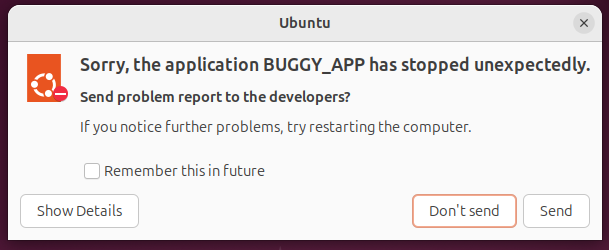
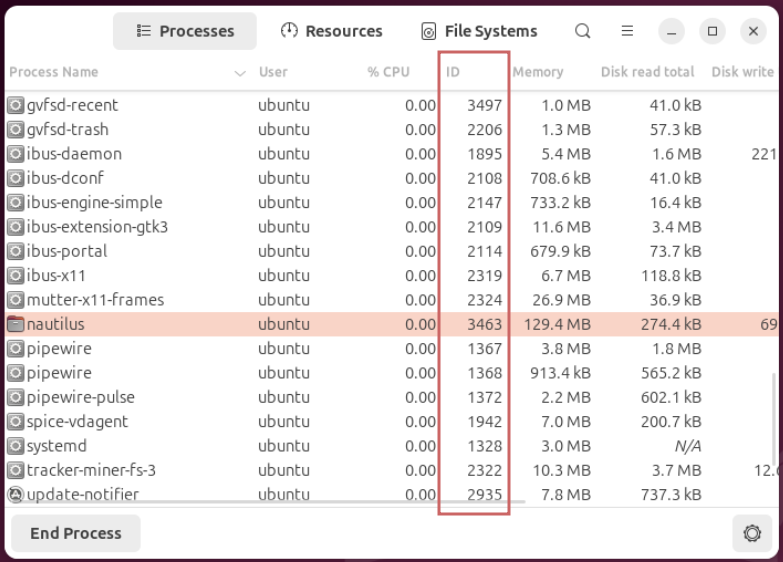
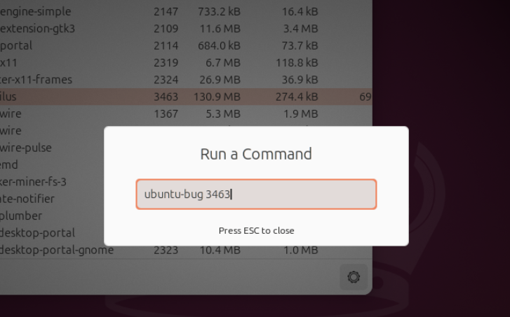
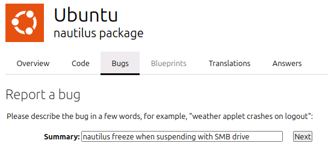
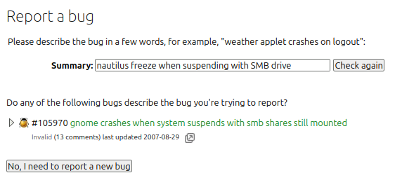
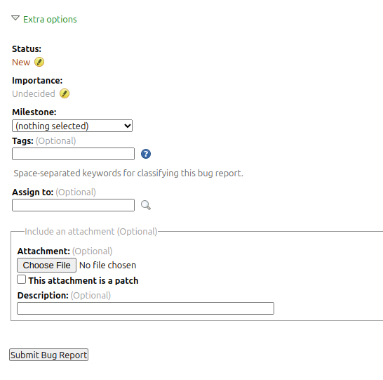

(how-to-report-a-bug)=
# How to report a bug

```{note}
Once a bug is filed, be prepared to answer questions, provide additional details and logs, and do testing for the fix. Bugs have a greater chance to get resolved when reporters are engaged.
See this article for in-depth coverage on the topic: [The Keys to Successful Bug Reporting | Ubuntu](https://ubuntu.com/blog/the-keys-to-successful-bug-reporting).
```

(getting-support)=
## Getting Support

Many times, a problem you're running into isn't a bug in Ubuntu, but rather a problem resulting from your setup, a mistake, or a difficult-to-reproduce glitch. Even if you have found a legitimate bug, making a proper bug report is somewhat of a skill in and of itself. If you're in doubt, or if you don't have the time to learn how to do bug reporting, Ubuntu provides several live chat support channels on {ref}`Matrix <using-matrix>`. Volunteers here can walk you through how to debug the problem you've run into, and potentially help you fix it, and file a bug report if necessary.

If you're sure you've found a bug, and are interested in learning proper bug reporting, the rest of this guide will walk you through the bug reporting process for Ubuntu.


(how-to-report-bugs)=
## How to report bugs

Ubuntu uses {ref}`Launchpad <about-launchpad>` to keep track of bugs and their fixes.

This involves running a command `ubuntu-bug` (aliases `apport-bug` and `apport-collect`). Note, this only applies to traditional .deb packages.

```none
ubuntu-bug buggy-package-name
```

That will collect information from the local system on the problematic program, and then open a form in a web browser for your comments.

If `ubuntu-bug` does not work, or reports that the package isn't installed, it's likely because the package is a snap package. For snap packages, run
```none
snap report-issue buggy-snap-name
```

The bug tracker and contacts for snaps are also listed on the individual snap package page on [https://snapcraft.io/](https://snapcraft.io/). Search for the buggy snap package name and look for the `report a bug` link or contact.


(create-a-launchpad-account)=
## Create a Launchpad account

If you don’t already have one - you need to [create a Launchpad account](https://documentation.ubuntu.com/launchpad/user/YourAccount/NewAccount/). This will allow you to file new bugs and comment on existing ones.


(determine-if-the-bug-is-really-a-bug)=
## Determine if the bug is really a bug

You should **not** file a bug if you are:

* **Requesting new software:** You should follow the guidelines at {ref}`New Packages<new-packages>`.

* **Requesting support:** See the list of {ref}`community-support` resources.

* **Discussing features, existing policy, proposing features, or ideas:** This belongs to the [ubuntu-devel-discuss](https://lists.ubuntu.com/mailman/listinfo/ubuntu-devel-discuss) mailing list.

* **Using a package not provided by the default, supported Ubuntu repositories:** Unsupported software can cause a variety of issues, even to the operating system. For this reason, you should try reproducing the issue on systems which only have supported software installed to increase the chances your bug will be addressed. Typically, what isn't supported is software from a PPA (Personal Package Archive), 3rd party packages, self-compiled software, etc. For more on supported Ubuntu repositories, please see {ref}`package-archive <package-archive>`. If you are using unsupported software, it is best to contact the maintainers directly. Instructions are generally available on the program maintainer's website.

(perform-a-survey-of-your-problem)=
## Perform a survey of your problem

First, check the [release notes](https://documentation.ubuntu.com/release-notes/) of your supported version of Ubuntu for any known issues.
Second, check [Launchpad](https://bugs.launchpad.net/) for any duplicate bugs or issues, and make note of this.

```{note}
If you want to file a translation or misspelling bug, follow the instructions [here](#translation).
```


(reporting-a-crash)=
## Reporting a crash

If an application crashes, what typically happens is {ref}`debugging-apport` will display a window noting it is collecting information about the crash:


Once done, it will ask you if you would like to report it.

```{note}
Before continuing, make sure the package [whoopsie](https://launchpad.net/ubuntu/+source/whoopsie) is installed. Otherwise, Apport will appear to upload a crash report, but only actually does so if whoopsie is installed. Whoopsie is installed by default for users of ubuntu-desktop and many flavors, but for server users, whoopsie has to be installed manually with `apt-get install whoopsie`.
```

Once you report the crash, what happens next is dependent on what release you are using.


(reporting-crash-in-the-development-release)=
### Reporting crash in the development release

What happens next is a web browser opens requesting you to login, and subsequently create a bug report on Launchpad. This report is automatically processed by [Apport Retracing Service](https://help.ubuntu.com/community/ApportRetracingService), in order to provide developers with debugging information that makes it easier to fix the problem.


(reporting-a-crash-in-the-stable-release)=
### Reporting a crash in the stable release

By default, Apport will not upload crash reports to Launchpad for a stable release (see bug {lpbug}`994921`). Instead, crash reports are uploaded to [Ubuntu's Error Tracker](https://errors.ubuntu.com/).

If you have a need to file a report on Launchpad anyway (e.g. you don't have access to the errors infrastructure, you want to subscribe others to a report to review it, etc.) one may do so by editing:

```none
/etc/apport/crashdb.conf
```

and change:

```python
if _is_ubuntu_stable_release():
    databases["ubuntu"]["problem_types"] = ["Bug", "Package"]
```

to:

```python
#if _is_ubuntu_stable_release():
#    databases["ubuntu"]["problem_types"] = ["Bug", "Package"]
```

Save, close, and file the crash report via:

```none
ubuntu-bug /var/crash/FILENAME.crash
```

Where FILENAME is the file name of the crash file you want to report.


(reporting-a-crash-when-no-message-shows-up-and-crash-files-created)=
### Reporting a crash when no message shows up and crash files created

Sometimes, Apport creates a crash file, but doesn't display a message asking to make a report about it. In this case, one may file a crash report via a terminal:

```none
ubuntu-bug /var/crash/FILENAME.crash
```

Where FILENAME is the file name of the crash file you want to report.

To confirm it was reported successfully to Ubuntu's Error Tracker, one may gather the ID via:

```none
sudo cat /var/lib/whoopsie/whoopsie-id
```

and then go to the following URL with ID replaced with that gathered in the previous terminal command:

```none
https://errors.ubuntu.com/user/ID
```


(reporting-a-crash-when-no-message-shows-up-and-crash-files-not-created)=
### Reporting a crash when no message shows up and crash files not created

Sometimes, Apport doesn't create crash files after a crash. If this is due to Apport being disabled one may edit the file:

```none
/etc/default/apport
```

and change:

```none
enabled=0
```

to:

```none
enabled=1
```

If Apport is enabled, then you may have one of the following issues:

* LibreOffice is crashing, and neither Apport or the built-in crash reporter captures the crash. For more on this, please see {lpbug}`1537566`.

* For system crashes (e.g. system locks up, freezes, logs you out, etc.) one my gather debugging information about [system crashes](https://help.ubuntu.com/community/DebuggingSystemCrash).

* For application crashes (e.g. GUI application crash) one will have to manually capture the crash details following [this article](https://wiki.ubuntu.com/DebuggingProgramCrash).


(reporting-non-crash-hardware-and-desktop-application-bugs)=
## Reporting non-crash hardware and desktop application bugs

The method for reporting bugs in Ubuntu is by using the tool `ubuntu-bug`, otherwise known as **Apport**. When reporting a bug, you must tell Apport which program or {term}`package` is at fault.


(collecting-information-from-a-specific-package)=
### Collecting information from a specific package

Press Alt+F2 to open the “Run Command” screen:


Then, type `ubuntu-bug <package name>` and press Enter. If you’re not sure which package has the problem, refer to the instructions for [finding the right package](https://wiki.ubuntu.com/Bugs/FindRightPackage).

(collecting-information-from-a-currently-running-program)=
### Collecting information from a currently running program

To file a bug against a program that is currently running, open the System Monitor application and find the ID of the process.



Then type `ubuntu-bug ` followed by the process ID into the “Run Command” screen.




(filing-a-general-bug-against-no-particular-package)=
## Filing a general bug against no particular package

First, please {ref}`review potential package candidates <how-to-assign-a-bug-to-a-package>`. Only after reviewing this, if you are still not sure which package is affected by the bug, type `ubuntu-bug` in the “Run Command” screen and press Enter. This will guide you through a series of questions to gather more information about the bug and help you assign it to the appropriate package.


(complete-the-bug-report-filing-process)=
## Complete the bug report filing process

A window will then pop up, asking you if you want to report the bug. Click "Send Report" if you wish to proceed, or click "Content of the report" if you want to review the information Apport collected.

<!-- Image: apport-problem-report.png | Apport asking you to send the report -->

Apport will then upload the problem information to Launchpad, and a new browser window will then open to inform you that the bug report is being processed.

<!-- Image: information-upload.png | Apport uploading the problem information -->

<!-- Image: process-data2.png | Launchpad processing the bug report data -->

After the bug report data has been processed, a new page will open that will ask you for the bug report's title. The bug title will appear in all bug listings so make sure it represents the bug well. Be succinct but descriptive in your title. For example: "On noble, foo fail to launch when started from the application icon" makes that bug easy to identify. When you're done, click "Next".



A search will then occur based on the title you gave to the bug report, and will show potentially similar ones. If one of these seems to be the exact bug you're reporting, click its title, then "Yes, this is the bug I'm trying to report". If not, click "No, I need to report a new bug".



Launchpad will then ask you for further information. It's important that you specify three things:

1. What you expected to happen

1. What actually happened

1. If possible, a minimal series of steps necessary to make it happen, where step 1 is "start the program"

Fill in the description field with as much information as you can, it is better to have too much information in the description than not enough.

At then bottom of the page, there are some extra options you can use to make your bug report more complete:

* **This bug is a security vulnerability:** Please check this **_only_** if your bug report describes a behavior that could be exploited to compromise your security or safety, as well as cause issues such as identity theft or "hijacking".

* **Tags:** You can {ref}`add here tags <bug-tags>` that pertain to your bug report. The predefined values should be left alone.

* **Include an attachment:** Using this option, you can add supporting attachments to explain or help others reproduce the bug. This might include a screenshot, a video capture of the problem or a sample document that triggers the fault. If necessary, additional attachments can be added after the bug is reported via **Add a comment/attachment** at the bottom of the page. Please check {ref}`how-to-debug-an-apport-crash` for any further information to provide. It is vital for developers to get this information, as it contains the minimum information necessary for a developer to begin working on your bug.

* Please note that if one files a bug against the [linux](https://launchpad.net/ubuntu/+source/linux) kernel package, you do not need to add as an attachment the terminal command:

```none
lspci -vvnn
lspci -vnvn
```

This is due to how [Launchpad](https://help.ubuntu.com/community/Launchpad) automatically generates this as an additional attachment.



When you're done, click "Submit bug report".


(tips-and-tricks)=
## Tips and tricks


(filing-bugs-when-offline-or-using-a-headless-setup)=
### Filing bugs when offline or using a headless setup

In the event that you have an issue with your internet connection, want to file a bug for another system, or have trouble reporting from a headless setup, you can still do this using apport.

* For a bug report about a crash, copy over the .crash file created in the /var/crash folder to the new computer. Then report it from the new computer via a terminal:

```none
ubuntu-bug FILENAME.crash
```

* For a bug report about any other issue, from the computer with the problem execute the following at a terminal:

```none
ubuntu-bug PACKAGENAME --save FILENAME.apport
```

Copy this over to the new computer. If filing a new report, execute via a terminal:

```none
ubuntu-bug FILENAME.apport
```

Please do not attach the `.apport` or `.crash` file to the report, as this is not the same as performing the above-mentioned steps.


(filing-bugs-manually-at-launchpad-net)=
### Filing bugs manually at Launchpad.net

Before you proceed, you should think about the nature of the problem you're facing. If Ubuntu or its software seems to simply be generally "misbehaving", it might not be a software bug, but it is still a problem we want to help fix. We have an entire community of people who can help you in real time on our  {ref}`Matrix channels and Discourse forums <community-support>`. On the other hand, if you are absolutely sure that you've encountered a legitimate error in the software's behavior (especially one that can be reproduced regularly), and you're sure you don't need any help, then continue with the bug reporting process.

If for some reason you cannot file a bug using the *Apport* tool you can file one via [Launchpad's own bug report form](https://bugs.launchpad.net/ubuntu/+filebug/+login?no-redirect). When doing so it is best if you have determined which package it should be filed against. Read {ref}`how-to-assign-a-bug-to-a-package` for guidance or use [Launchpad's package search feature](https://launchpad.net/ubuntu/). We don't recommend this method for most bug reports because they will likely be missing crucial information, use `ubuntu-bug` if you can!

To file a bug against a specific package you can also use a URL like the following:

`http://bugs.launchpad.net/ubuntu/+source/PACKAGENAME/+filebug?no-redirect`

where `PACKAGENAME` is the name of the source package about which you want to file the bug report.

In the event that you want to request a piece of software be packaged for Ubuntu please follow the instructions in {ref}`New Packages<new-packages>`.


(error-the-launchpadlib-python-module-is-not-installed)=
### Error: The launchpadlib Python module is not installed

If one gets the following error while trying to perform apport-collect:

```none
ERROR: The launchpadlib Python module is not installed. This functionality
is not available.
```

please install the following package:

```none
sudo apt-get -y install python-launchpadlib
```


(package-libreoffice-not-installed-and-no-hook-available-ignoring)=
### Package libreoffice not installed and no hook available, ignoring

If one attempts to apport-collect and gets the error message:

```none
Package libreoffice not installed and no hook available, ignoring
```

one has to install the following package:

```none
sudo apt-get -y install libreoffice
```


(non-crash-userspace-bugs)=
### Non-crash userspace bugs

Sometimes it is useful to take a picture (with a camera or via !PrtSc button), or [screencast](https://help.ubuntu.com/community/Screencast) of the problem to demonstrate how you reproduced it, what the bug specifically shows, and the impact it has.


(translation)=
(filing-a-translation-bug)=
### Filing a translation bug

You should file a translation bug if you are experiencing one of the following issues:

* Wrong translations or spelling mistakes for languages other than English in applications

* Errors in spellcheckers or language support

* A string from an application not available for translation in [Launchpad Translations](https://translations.launchpad.net/ubuntu)

* An application from the Ubuntu main repository not available for translation in [Launchpad Translations](https://translations.launchpad.net/ubuntu)

* A translation made in [Launchpad Translations](https://translations.launchpad.net/ubuntu) and not updated in the Ubuntu language packs

* A duplicate translation template (the same application can be translated in two different places) in [Launchpad Translations](https://translations.launchpad.net/ubuntu)

* A template/translation no longer used in Ubuntu and that should be disabled from [Launchpad Translations](https://translations.launchpad.net/ubuntu)
In case of doubt, you can always [contact the Translations team](https://wiki.ubuntu.com/Translations/Contact).

All translation issues should be filed against the [Ubuntu Translations project](https://bugs.launchpad.net/ubuntu-translations). From there the bugs will be triaged and assigned to the right person and package.


(bug-reporting-etiquette)=
## Bug reporting etiquette

Following bug reporting etiquette best presents your Launchpad report so that it gets addressed as soon as possible. As well, it minimizes unnecessary pain points for developers, triagers, and original reporters.


(all-bug-reports)=
### All bug reports

* **Please do not file bug reports about End-of-Life operating systems.**
   This includes release of Ubuntu, and alternative operating systems. Expecting Ubuntu to provide interoperability with an insecure, end-of-life operating system is simply irresponsible, and inconsiderate of the finite resources of the Ubuntu Community. See information regarding {ref}`list-of-releases`. Please see the website of the vendor of the operating system for EOL and support information.

* **Please do not speculate on what you think is or isn't a duplicate report**
   The exception to this is you are a developer, know specifically where in the code the problem is, and would be submitting a patch to fix the issue. However, noting things like, "I checked Google and found bug report number...", "Why should I file a new report when this is a duplicate?" is largely unhelpful as it tends not to be a duplicate, and already has been or easily done by triagers and developers. Instead, if you are the original reporter, ensuring the report has all the requested testing information performed would be the fastest way to ensure your bug is resolved as soon as possible. If you are not the original reporter, it's best to file a new report, so that necessary debugging attachments are reviewed. It is a common misconception that filing what one initially believes to be a potential duplicate report is not helpful. Filing a new report is quite helpful, and is preferred to ease triaging and development.

* **Please do not quote Wikipedia and other non-primary resource information as fact on Launchpad.**

* **Please do not complain because someone sent what one perceives to be a automated or "canned" response**.
   If the response is asking you to do something that you haven't done (ex. test the latest development release, file a new report, etc.) do it, as it would get you closer to having your bug fixed faster. Complaining about this is inconsiderate of the Ubuntu triagers and developers who are saving time in comparison to hand typing every single character in an e-mail that goes out their inbox.

* **Please test the latest version of the package that is considered responsible for the problem.**
   For bugs in the [Linux (Ubuntu)](https://launchpad.net/ubuntu/+source/linux) package, unless the upstream maintainer or kernel developer notes otherwise, if a new mainline kernel comes out, and you haven't tested with it, you run the strong risk of it not being attended to upstream.

* **Please do not post comments such as “Me too!”, “+1”, “bump”, “same here”, etc.**, as it is largely unhelpful, produces spammy e-mail traffic to everyone subscribed to the report, and quite often turns out not to be the same root cause.

* **Please do not post URLs of logs.**
   For example, links to pastebin.com, paste.ubuntu.com, dropbox.com, etc. If a triager or developer asks you for some information on reproducing or testing, please do not make them dumpster dive by just posting a URL, or saying you already did something in some other report. Instead, put the full reproduction or testing results into the report itself, uncompressed and untarred.

* **Please do not stack multiple issues into one report**.
   For example, jamming suspend and hibernate into one report, reporting multiple hotkey problems into one report (ex. Fn+F3 doesn't turn off my laptop WiFi, Fn+Right doesn't turn the brightness on my backlight down, my brightness settings are not remembered after reboot, etc.). Please make one report for each individual problem.

* **Please do not complain about how long it takes to fix a bug.**
   This goes along with saying things like severity of your bug is high so it should be fixed immediately, “I cannot believe it’s not fixed…”, XYZ person(s) do not care about fixing bugs, etc. Especially, if you have not followed the directions mentioned in this article, let alone contributed code upstream. This type of behavior is nonconstructive, irritating to others who read your e-mail, and spammy. We all want to see every bug fixed as soon as possible! Naturally, bugs being fixed is limited to reproducibility and clarity of the bug report, the actual impact the bug has on the community, and available developer resources.

* **Please keep the bug report as objective as possible.**
   It is desired for you to provide a fact based, technical impact statement on you, your environment, and the potential or actual impact on the community at large.

* **Please provide all relevant information from {ref}`how-to-debug-an-apport-crash` when you first report your bug**.
   This is one of the top reasons why bugs do not get marked {ref}`Triaged <bug-status>`, as the minimum requirements for triaging, and dealing with the problem by a developer are not provided.

* **Please avoid arguing with triagers and developers.**
   If a triager or developer asks you to provide information, just provide the information as requested. An example of this is claiming exemption because you or someone else filed a bug report upstream or downstream (which is publicly viewable, and has no restrictions on who can file). You are being asked for this information so that it would provide more information on how to fix the problem. Also, not everyone has access to the hardware you are reporting against, or reproduce the problem as advised in the report. Having you provide the information helps eliminate the difficulty in fixing your bug. If you have a strong disagreement with what a triager or developer is asking of you, please resolve it with them directly via personal message, not on the bug report. This avoids turning a bug development report into a “let’s talk about talking about the problem” tangent, distracting from having your bug solved. The Ubuntu community takes a favor to objective, technical discourse.

* **Please do not add project tasks to bug reports that are invalid because they are not supported**.
   For example, if you were using the an application or package from a PPA that is also housed in a supported Ubuntu repository, reported a bug against the software on Launchpad as PACKAGE (Ubuntu), where PACKAGE is the name of the software, please do not add a Launchpad Project to the report, or change the PACKAGE (Ubuntu) to an upstream project task. The purposes of adding the upstream project to a report is to track valid bugs in Ubuntu that are valid upstream, and may have been reported upstream, not to start another upstream bug tracker.

* **Many of the triagers and developers who are providing support to you, are volunteers doing so out of altruism. Please keep this in mind when making your comments.**

* **Please do not compress/tar attachments when posting them to a bug report.**
   Launchpad doesn't have the same attachment size restriction as other bug reporting platforms. Hence, one may attach large files without fear of rejection. While it is appreciated that one is being considerate and efficient regarding reducing network bandwidth traffic, and storage requirements, this is counteracted by hindering the speed with which a triager or developer may begin analyzing the logs you provide.

* **Please test the latest version of the software from upstream.**
   Testing the latest upstream release helps in finding out if the issue is a downstream (Ubuntu) issue, or an upstream one as well. If an upstream, then they may also be engaged in seeking support for the problem.

* **Please check to see if you problem is a regression.**
   If your bug is a regression, it is most helpful to have it bisected. If it is a linux kernel issue, one would consult the article on [bisection](https://wiki.ubuntu.com/Kernel/KernelBisection). Report your bisect results in the report.

* **Please do not run apport-collect more than once per release tested.**
   For example, if you originally reported a bug in an earlier release via Apport, and then could reproduce it a later release, only run apport-collect once in the earlier release. This minimizes unnecessary email traffic to those subscribed to your report and keeps the report efficient.

* **Please do not change the Status of reports confirmed to be Fix Released.**
   For example, a bug was reported against version 1 of the software. Version 2 comes out and is confirmed fixed by the original reporter. However, version 3 comes out later, and either the same or different problem occurs. Instead of reopening the report about version 3 causing a new problem, please file a new report. This allows the focus to be on how the issue was a regression going from version 2 to 3, and doesn't carry over the baggage from the old report into the new one.


(hardware-bug-reports-linux-kernel-xorg-sound-etc)=
### Hardware bug reports (linux kernel, xorg, sound, etc.)

* **Before filing your report, please update your buggy and outdated BIOS, and hardware firmware (CF card readers, SSDs, USB 3.0 controllers, DVD/CD drives, external USB drives, etc.) to the newest available from your vendor.**
   Outdated and buggy BIOS and firmware is a common cause of a variety of issues. For example, freezing after lightDM login, intermittent wireless, suspend/hibernate not working, intermittent touchpad, certain keys on keyboard not working correctly, card readers not working, and kernel panics after plugging USB drive in (this is by no means an exhaustive list). In addition, BIOS updates are for collateral damage avoidance. For more on this, please see [here](https://help.ubuntu.com/community/BIOSUpdate).

* **One report, per person, per hardware combination, per bug**.
   Many [Linux](https://launchpad.net/ubuntu/+source/linux) package, hardware, and other non-user space bugs are hardware dependent on both the hardware itself, and what other hardware the problematic hardware is connected to. For more on this please see [here](https://wiki.ubuntu.com/Bugs/BestPractices#X.2BAC8-Reporting.Focus_on_One_Issue), and further below in this article.

* **Please do not post comments to another persons report, claiming you have the same or similar hardware or problem.**
   Instead, please file a separate report, and make comments there. This is because no one can verify if you would have the same problem or not, because your hardware can not be analyzed. Also, vendors can have different parts under the hood of the same model line.

* **Please do not attempt to apport-collect to another persons report.**
   Running apport-collect when not specifically asked by a triager or developer creates spammy E-Mail traffic for those subscribed, clutters up the bug report with undesired attachments, and hinders the bug getting addressed quickly. As well, your attachments are subject to immediate deletion at the discretion of developers and triagers. Instead, please open a new report via ubuntu-bug. Please note that attempting to run `apport-collect bug_number` against a [linux](https://launchpad.net/ubuntu/+source/linux) package bug report, while booted into a [mainline](https://wiki.ubuntu.com/Kernel/MainlineBuilds) linux kernel will not work. This is due to how Ubuntu does not provide support for mainline kernels. For more on this, please see [here](https://wiki.ubuntu.com/Kernel/MainlineBuilds#Kernel.2BAC8-FAQ.2BAC8-DebuggingMainlineBuildsSupport.Does_the_kernel_team_support_the_mainline_kernel_builds.3F).

* **Please do not solicit non-original reporters to post comments, attachments, etc.**

* **Please do not attach anything to another persons report.**
   Adding undesired attachments when not asked by a triager or developer creates spammy E-Mail traffic for those subscribed, clutters up the bug report with undesired attachments, and hinders the bug getting addressed quickly. As well, your attachments are subject to deletion at the discretion of developers and triagers.


(getting-advice)=
## Getting advice

Still have doubts about the bug report filing process? You can ask someone on {matrix}`Matrix <discuss>`.
