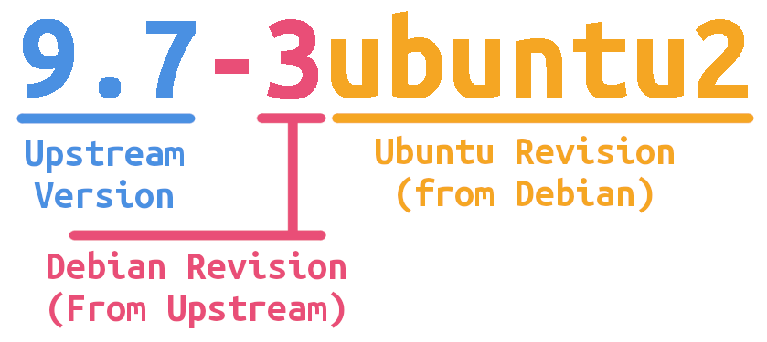

(version-strings)=
# Version string format

Choosing the {manpage}`appropriate version <deb-version(7)>` can be complex,
since there are numerous conditions to consider. This page explains the
foundational concepts (shared with Debian) along with the Ubuntu-specific
edge cases, and finishes with a {ref}`decision flowchart <version-flowchart>`
and a consolidated {ref}`table of examples <version-table-of-examples>`.


(anatomy-of-a-version-string)=
## Anatomy of a version string

Package version strings can have many edge cases, which are discussed in the
sections below, but in the most common case a version string contains three
parts:

- The **upstream version**, which is the version as released by the upstream
  project.
  - The legal characters in the upstream version are letters, digits, `.`, `+`,
    `~`, and `-`. Upstream versioning may be adjusted to fit this format if
    necessary.
  - The upstream version must begin with a digit.
- The **Debian revision**, which counts up each time the package has been
  modified by Debian.
  - The legal characters in the Debian revision are letters, digits, `.`, `+`,
    and `~`.
  - It is split from the upstream version by a single hyphen.
- The **Ubuntu revision**, which counts up each time the _Debian_ package has
  been modified by Ubuntu.
  - The most common case for the Ubuntu revision is the string `ubuntu`,
    followed by a number (for example `ubuntu1`, `ubuntu2`). The legal
    characters in the Ubuntu revision are letters, digits, `.`, `+`, and `~`.

This distinction lets each party involved in providing a package -- upstream,
Debian, and Ubuntu -- modify and iterate on their own section of the version
number without interfering with the others. When everyone abides by these
conventions, package upgradability is guaranteed and much of a package's history
can be understood by looking at its version alone.

For example, here is the current (as of writing) version of the {pkg}`coreutils`
package in Ubuntu 26.04 LTS:



- The upstream version is `9.7`.
- Debian has uploaded **three** revisions to the upstream version, so the Debian
  revision is `3`.
- Ubuntu has uploaded **two** revisions to Debian `9.7-3`, so the Ubuntu
  revision is `ubuntu2`.

Since Ubuntu's versioning specifics are derived from Debian, it is worthwhile to
also review the
[Debian control field "Version"](https://www.debian.org/doc/debian-policy/ch-controlfields.html#version)
to understand the foundational principles.


(comparing-versions)=
## Comparing versions

To compare two version strings, use {command}`dpkg --compare-versions`. The
available comparison operators are `lt`, `le`, `eq`, `ne`, `ge`, and `gt`:

```{code}
:class: codeblock-wrap

$ dpkg --compare-versions 1.2.3-3ubuntu1 lt 1.2.4-2ubuntu2 && echo true || echo false
```

It is worth noting the special sorting rules regarding the `~` character.
Namely, `~` sorts _before_ everything else, including the empty string. So `1.0~rc1` sorts _before_ `1.0`.


(standard-version-bumps)=
## Standard version bumps

The great majority of uploads fall into one of three routine cases: making an
Ubuntu change in the development release, merging a newer Debian version, or
syncing an unmodified Debian version. These are covered first; the special cases
follow.


(version-devel-upload)=
### Uploading to the development release

Changes within the development release are made by adding or incrementing the
number immediately following the `ubuntu` string.

The first Ubuntu modification adds `ubuntu1` to the Debian revision, and
subsequent Ubuntu changes increment that suffix (`ubuntu1` → `ubuntu2`).

> Example: adding a change to `2.0-2` in the development release produces
  `2.0-2ubuntu1`. A further change produces `2.0-2ubuntu2`.

If the current version instead ends in a `buildN`
({ref}`no-change rebuild <version-no-change-rebuilds>`) suffix, the package is
considered unchanged from the Debian revision, so a new Ubuntu change starts the
counter afresh at `ubuntu1` (for example `2.0-3build2` → `2.0-3ubuntu1`).


(version-merging-from-debian)=
### Merging from Debian

If Ubuntu carries delta, the package cannot be
{ref}`automatically synced <version-syncing-from-debian>`, since that delta
would be lost. Instead, an Ubuntu developer periodically
{ref}`merges <merge-process>` the Ubuntu delta with the newer content from
Debian (and, indirectly, from upstream).

On a merge, the version becomes the new Debian version with the Ubuntu counter
reset to `ubuntu1`.

> Example: merging Debian `3.1-2` into the development release while retaining
  former Ubuntu delta from `2.1-1ubuntu2` produces `3.1-2ubuntu1`.


(version-syncing-from-debian)=
### Syncing from Debian

Sometimes the desired change has already been packaged by Debian in a newer
version. During the development cycle, the Archive tooling automatically copies,
or _syncs_, new package versions from Debian. Only packages with no Ubuntu delta
(determined via the presence of the `ubuntu` string in the Ubuntu revision) are synced
automatically.

When a sync happens -- automatically, or as a
{ref}`manual sync <how-to-request-a-sync>` -- the version is **identical to the
Debian version**; no suffix is added.

> Example: syncing Debian `2.0-3` on top of Ubuntu `2.0-2` or `2.0-2build1`
  produces `2.0-3`.

There are two common cases that require a manual sync:

- After the development release reaches {ref}`debian-import-freeze`, the sync
  automation is disabled, so any required update must be
  {ref}`manually synced <how-to-request-a-sync>`.
- When a package had Ubuntu delta that is no longer needed with the new Debian
  version (for example, Debian adopted the Ubuntu changes, or they were
  cherry-picked patches now present upstream), a
  {ref}`manual re-sync <how-to-request-a-sync>` drops the delta. The version is
  again identical to Debian.


(version-debian-source-suffixes)=
### Debian source-repackaging suffixes (`+dfsg`, `+ds`)

You will often see extra markers on the **upstream-version** portion of a
package (before the `-debian_revision`), most commonly `+dfsg` and `+ds`. Despite
being added by Debian, they are part of the upstream version, not the Debian
revision. They indicate that the source tarball Debian ships differs from the
pristine upstream release. Ubuntu inherits them unchanged: there is never a need
to add, remove, or renumber them ourselves.

- **`+dfsg`** (Debian Free Software Guidelines) -- the upstream tarball was
  repackaged to remove content that does not meet the
  [DFSG](https://www.debian.org/social_contract#guidelines), such as non-free
  files. For example, `7.80+dfsg1-5`.
- **`+ds`** (Debian source) -- the tarball was repackaged for reasons other than
  licensing, for example to drop bundled third-party code, pre-built artifacts,
  or very large test data. For example, `1.2.3+ds-1`.

A trailing number (`+dfsg1`, `+ds2`) counts the repackaging revisions. Because
`+` sorts _after_ the bare version, `7.80+dfsg1` is treated as a _later_ version
than a hypothetical pristine `7.80`, which keeps upgrade ordering sensible.


(special-cases-ubuntu-revision)=
## Special cases: the Ubuntu revision

If a package in Ubuntu has differences that prevent it from being automatically
updated to the latest Debian version, we say the package has **Ubuntu delta**
(or just "delta"). Most Ubuntu-specific changes constitute delta, and the
`ubuntuN` number is incremented with each such change.

If the Ubuntu revision does _not_ begin with `ubuntu`, the package **will** be
automatically synced and overwritten by a later Debian upload. The following
sections cover the cases where a different Ubuntu revision string is used.


(version-no-change-rebuilds)=
### No-change rebuilds (`build`)

Sometimes a package needs its binaries rebuilt without any source change -- for
example, to re-link against a newer {term}`ABI` of a dependency as part of a
{ref}`transition <transitions>`.

A rebuild should not prevent future syncing, so in this case:

- If the current version has no delta, add a `buildN` suffix rather than
  `ubuntuN` (`2.0-2` → `2.0-2build1`).
- If a `buildN` suffix is already present, increment it
  (`2.0-2build1` → `2.0-2build2`).
- If an `ubuntuN` suffix is already present, there would be no auto-sync anyway,
  so simply increment it (`2.0-2ubuntu2` → `2.0-2ubuntu3`).

For {ref}`native packages <version-native-packages>`, it is weakly defined
whether a no-change rebuild is a version increment or a `build` suffix; both are
present in the Archive and both work. Follow whatever the package has used so
far (for example `2.0ubuntu.build1`).


(version-syncable-changes)=
### Syncable changes (`maysync` and `willsync`)

Sometimes you need to make a non-trivial change to a package but still want it to
be automatically synced with Debian later. Two suffixes exist for this:
`maysync` and `willsync`.

Both indicate that the package may still be automatically synced with Debian
(only an `ubuntu` revision prevents syncing). The only difference is ordering:
`maysync1` sorts _before_ `ubuntu1`, while `willsync1` sorts _after_ `ubuntu1`.
Therefore:

- Use `maysync` if the package previously had **no** delta, so that delta can
  still be added later in the standard way (`ubuntu` > `maysync`).
- Use `willsync` if the package previously **had** delta, to indicate that it is
  now syncable again (`willsync` > `ubuntu`), so the next Debian update
  overwrites it automatically.

> Example: A syncable upload on top of `2.0-1` is `2.0-1maysync1`, and a syncable upload on top of `2.0-1ubuntu1` is `2.0-1willsync1`.

It may seem strange to upload a syncable version on top of a version that is
_already_ synced with Debian, but it can be necessary. For example:

- You need a change present only in an unreleased Debian version.
- You are working around a temporary packaging issue (for example, a
  dependency-related build failure) with a temporary delta (`maysync1`) that is
  then immediately dropped (`maysync2`).


(version-srus)=
### Stable release updates (SRUs)

After a version of Ubuntu is released, changes follow a slightly different
scheme that guarantees upgradability to later releases. Only the _Ubuntu
revision_ changes:

- Increment `Y` in the numeric `ubuntuX.Y` suffix (`ubuntu3.1` → `ubuntu3.2`).
- Never increment `X`; an Ubuntu delta is always captured in `Y`.
- If this is the first change via the SRU process, add `.1`
  (`ubuntu3` → `ubuntu3.1`).
- If there was no `ubuntuX` before, use `ubuntu0.1`. The `0` records that there
  was no Ubuntu delta before this first SRU change (`2.0-2` → `2.0-2ubuntu0.1`).

```{important}
A given version string may only ever be uploaded **once** to the Archive, across
_all_ releases. If the same fix is applied to a package that has the same version
in several releases, using the same version string in each would create a
conflict and break upgradability. To disambiguate, insert the per-release
`YY.MM` version between `ubuntuX` and the `.Y` increment.
```

> Example: applying the same fix to `2.0-2` in both 25.04 and 24.04 produces
  `2.0-2ubuntu0.25.04.1` and `2.0-2ubuntu0.24.04.1` respectively.


(version-backport-from-upstream)=
### Backporting a new upstream version

In the rare case of a _new upstream release being pushed to all stable
releases_, the upload loses all of its former version suffixes. This is common
in some minor-release exception processes, where the most recent upstream
content is picked up while avoiding regressions from packaging changes. The
upload should:

- Signal that it is not based on a Debian packaging version, using `-0` as the
  Debian revision (see {ref}`version-ahead-of-debian`).
- Signal that it was not packaged in this Ubuntu release before, using
  `ubuntu0.`.
- Add a per-release `YY.MM` suffix (required because the same version lands in
  multiple releases -- see the note above).
- Add a `.1` increment for subsequent per-release SRU uploads.

> Example: uploading upstream `3.1` -- packaged as what is already in the LTS,
  not with the delta that might be in `3.1-1ubuntu2` -- targeting 22.04 produces
  `3.1-0ubuntu0.22.04.1`.

The new version is independent of the version already present in the target
release.

(version-backport-from-devel)=
### Backporting from the development release

If instead the backport has no _meaningful differences_ from what is in the
current development release (a common practice for packages that keep the same
version everywhere), with only minimal backporting adaptations, it should:

- Start with the **same version** as the one in the development release, to
  signal that it is basically identical but backported.
- Add a `~` so it sorts _earlier_ than the version in the development release.
- Add a per-release `YY.MM` suffix.
- Add a `.1` increment for subsequent per-release SRU uploads.

> Example: uploading `3.1`, more or less identical to the `3.1-1ubuntu2` in the
  development release, targeting 22.04 produces `3.1-1ubuntu2~22.04.1`.

As with the {ref}`backport from upstream <version-backport-from-upstream>`, the new version is independent of the version already present in the target release.

```{note}
If the package in the development release is a
{ref}`native package <version-native-packages>`, use _the same version_ as in
the development release, with the `~YY.MM.1` suffix (for example a devel version
of `3.1` becomes `3.1~22.04.1`).
```


(special-cases-debian-revision)=
## Special cases: the Debian revision


(version-ahead-of-debian)=
### Going ahead of Debian

Sometimes Ubuntu packages a version that Debian has never packaged -- for
example, a newer upstream release, or a specific upstream commit. In that case
we use a Debian revision of `0` to indicate that this is not based on any Debian
packaging version.

Because such a version is our own change, it must always carry an Ubuntu
revision as well, giving `-0ubuntu1` for the first development upload (which also
serves as the increment counter for further uploads).

> Example: uploading upstream `3.1` while Debian is not yet at `3.1` produces
  `3.1-0ubuntu1`.


The `-0` marker is specific to the Debian revision. The way the _upstream_
portion is written for pre-releases and git snapshots is described in
{ref}`special-cases-upstream-version` below -- note that Debian could package the
very same upstream snapshot, in which case it would use its own Debian revision
(such as `-1`) rather than `-0`.


(special-cases-upstream-version)=
## Special cases: the upstream version

The following conventions shape the **upstream version** portion only. When the
snapshot is one Ubuntu has packaged ahead of Debian, combine them with the
`-0ubuntuN` revision from {ref}`version-ahead-of-debian`.

(version-tagged-pre-releases)=
### Tagged pre-releases

If you are packaging a tagged pre-release, the version string needs a small
adjustment so that everything sorts properly. Take advantage of the `~`
character, which sorts _before_ everything else, including the empty string.

An upstream release of `3.1 Prerelease 1` is packaged with upstream version
`3.1~pre1`. This way, when `3.1` proper is eventually released, it is considered
a _later_ version than the pre-release, so updates and syncs work as expected.
You might also see `~rc1` for release candidates.

> Example: packaging `3.1` pre-release 1 ahead of Debian produces
  `3.1~pre1-0ubuntu1`.


(version-specific-git-commits)=
### Specific git commits

Sometimes it is desirable to package a specific upstream commit that is _not_ a
tagged release. Reasons include:

- Upstream has no new release yet, but we want the content up to a certain point
  in git.
- An upstream release is imminent, but to meet freeze deadlines we upload the
  state from git (moving to the final release before it ships).
- Upstream only publishes nightly builds and we need to pick one.

There are two ways to do this, depending on whether you anchor the version to the
**next** upstream release (a **pre**-release) or to the **previous** upstream
release (a **post**-release). If you know the identifier of the next upstream
release, use pre-release versioning; otherwise (for example, date-based
versioning, or uncertainty about whether the next release is major or minor), use
post-release versioning.

In both cases the upstream version has the same structure:

- The version you are anchoring to (for example `3.1`).
- A `~` (pre-release, sorts _first_) or a `+` (post-release, sorts _last_) to
  keep ordering correct.
- `git`, indicating a git snapshot.
- The date of the commit, in `YYYYMMDD` format.
- A dot (`.`).
- The first seven characters of the commit hash (for information).

> Example: A pre-release anchored to upcoming `3.1` at commit `f1eeced` on 2026-07-16, ahead
  of Debian, becomes `3.1~git20260716.f1eeced-0ubuntu1`. The equivalent
  post-release, anchored to the previous release, uses `+`:
  `3.1+git20260716.f1eeced-0ubuntu1`.


(other-special-cases)=
## Other special cases


(version-native-packages)=
### Native packages

Some packages have Debian or Ubuntu themselves as their upstream. These are
called **native packages**. As per the
[Debian source packages](https://www.debian.org/doc/debian-policy/ch-source.html#s-source-packages)
documentation, native packages are identified by the absence of a debian revision.

> Example: a package native to Debian `2.0` (no `-`) getting an Ubuntu change in
  the development release uses `2.0ubuntu1`.

The same applies to **native Ubuntu packages**, which also have no
`-debian_revision`. But remember that the package namespace is shared between
Debian and Ubuntu: a native Ubuntu package `foo` at version `1.0` could be
overwritten if Debian introduces a `foo` newer than `1.0`. To prevent this, add
an `ubuntu` suffix; otherwise auto-sync would use whichever version is newer
according to {command}`dpkg --compare-versions`.

To distinguish "a native Debian package that gained an Ubuntu delta" (which would
be `2.0ubuntu1`) from "a native Ubuntu package", the marker suffix for a native
Ubuntu package is a bare `ubuntu` (no number). Please migrate the former native
indication `ubuntu0` to this new format without the `0` (see the
[discussion on ubuntu-devel](https://lists.ubuntu.com/archives/ubuntu-devel/2025-July/043402.html)).

Native package versioning is package-dependent: whether it uses _major_,
_major.minor_, or any other pattern is the maintainer's choice, just as upstream
versions software however they see fit. Selecting the next version therefore
requires checking the package history or conferring with its maintainer.

> Example: a package native to Ubuntu `2.0ubuntu` (no `-`, `ubuntu` suffix)
  getting a change in the development release could use `2.1ubuntu` or
  `3.0ubuntu`. To migrate from the old `2.0ubuntu0` format, simply update to
  `2.1ubuntu` or `3.0ubuntu`.

```{note}
A maintainer may have reason for a native Ubuntu package to _not_ carry the
`ubuntu` suffix -- for example, if overwriting via auto-sync is desired, such as
coordinated uploads to both distributions during freeze. Any such deviation
should be explained in {file}`debian/README.source` so other packagers
understand the reasoning. If the deviation is expected to be short-lived (for
example, resolved next cycle), a note in {file}`debian/changelog` is sufficient.
```


(version-almost-native-packages)=
### Almost-native packages

_Almost-native packages_ are not a precise category, but some packages have
evolved that way. The classic example is {pkg}`snapd`, historically packaged
like a native package in Ubuntu with versions like `2.67+ubuntu24.04`, whose
content matches upstream 1:1. It now has both a
[separate upstream project with proper releases](https://github.com/canonical/snapd/tags)
and Debian packaging that uses a normal `2.67-1`-style version. It is also
usually backported with the same content to all active releases.

That combination means some of the normal rules do not apply, blending the
_native package_ and _backport from upstream_ cases. For such a package:

- The first element of the version matches the upstream version it represents
  (for example `2.67`).
- Because it is backported to multiple releases at the same version, but being
  native cannot use a `-`, the per-release suffix is added with `+ubuntuYY.MM`.
  (Former versions used just `+YY.MM`, but `+ubuntuYY.MM` is preferred for
  symmetry and to avoid auto-sync conflicts.)
- If further iterations are needed for the same upstream version and the same
  target release, add a `.n` increment.

| Previous                    | New upstream 2.67  | Change within 2.66     |
| --------------------------- | ------------------ | ---------------------- |
| LTS: `2.66+ubuntu24.04`     | `2.67+ubuntu24.04` | `2.66+ubuntu24.04.1`   |
| Devel: `2.66+ubuntu25.04`   | `2.67+ubuntu25.04` | `2.66+ubuntu25.04.1`   |
| LTS: `2.66+ubuntu24.04.1`   | `2.67+ubuntu24.04` | `2.66+ubuntu24.04.2`   |
| Devel: `2.66+ubuntu25.04.1` | `2.67+ubuntu25.04` | `2.66+ubuntu25.04.2`   |


(version-rolling-back)=
### Rolling back

In the rare case where an upgrade to a new upstream version caused a major
regression and the only way out is rolling back, the convention is to take the
current version and append `+really` followed by the version being reverted to.

> Example: uploading `3.1` caused a regression, so rolling back to the previous
  version `2.0-2ubuntu2` uses `3.1+really2.0-2ubuntu2`.

The Ubuntu-revision portion still follows the rules for the context of the
upload -- a development upload, a plain Debian upload, or an SRU:

| Before         | Current        | Upload                                    | Context       |
| -------------- | -------------- | ----------------------------------------- | ------------- |
| `2.0-2ubuntu2` | `3.1-2ubuntu1` | `3.1+really2.0-2ubuntu2`                  | Devel         |
| `7.80+dfsg1-5` | `7.91+dfsg1-1` | `7.91+dfsg1+really7.80+dfsg1-1ubuntu1`    | Ubuntu upload |
| `7.80+dfsg1-5` | `7.91+dfsg1-1` | `7.91+dfsg1+really7.80+dfsg1-1`           | Debian upload |
| `7.80+dfsg1-5` | `7.91+dfsg1-1` | `7.91+dfsg1+really7.80+dfsg1-1ubuntu0.1`  | Ubuntu SRU    |

(version-epochs)=
### Epochs

In extraordinarily rare circumstances, the versioning may need a complete reset.
This can happen because upstream radically altered their scheme or to resolve a serious
mistake. The version format allows an **epoch** to be prepended for this.

The epoch is a single integer followed by a colon at the beginning of the version
string. If no epoch is present (as for most packages), it is assumed to be `0`.

Changing the epoch should be done with care and requires consensus in Debian.
Epochs are explicitly **not** used when a package needs to be reverted to a
previous version (see {ref}`version-rolling-back`). See also
[epochs should be used sparingly](https://www.debian.org/doc/debian-policy/ch-controlfields.html#epochs-should-be-used-sparingly).

(versioning-examples)=
## Examples

(version-timeline-example)=
### Timeline example: standard flow

The following pathway illustrates the standard flow of a package starting with a
new upstream release. Suppose XX.04 is the current development release:

1. The current version of {pkg}`libfoo` in both Debian and Ubuntu is `6.6-1`.
2. The {pkg}`libfoo` maintainers release a new upstream version, `6.7`.
3. Debian packages it as `6.7-1`.
4. It syncs into Ubuntu, still as `6.7-1`.
5. Ubuntu rebuilds the package and uploads it as `6.7-1build1`.
6. Ubuntu adds some delta, uploading it as `6.7-1ubuntu1`.
7. Debian makes a change, uploading it as `6.7-2`.
8. Ubuntu rebases its delta onto the new Debian version, uploading `6.7-2ubuntu1`.
9. Ubuntu makes another patch, uploading `6.7-2ubuntu2`.
10. XX.04 is released.
11. A bug is found that needs patching in both XX.04 and XX.10:
    - In XX.10 (the new development release), the fix is uploaded as
      `6.7-2ubuntu3`.
    - The same fix is SRUed into XX.04 as `6.7-2ubuntu2.1`.


(version-timeline-ahead-of-debian)=
### Timeline example: Going Ahead of Debian

1. {pkg}`libbar` is `2.0-1` in both Debian and Ubuntu.
2. Upstream releases `2.1`.
3. Ubuntu wants the new upstream release before Debian is ready, so it {ref}`merges from upstream <version-ahead-of-debian>`, uploading `2.1-0ubuntu1`.
4. Ubuntu makes a patch, uploading `2.1-0ubuntu2`, and submits their patch to upstream.
5. Ubuntu's patch is accepted upstream.
6. Upstream releases version `2.2`, which includes Ubuntu's patch and a different fix.
7. Ubuntu backports `2.2`'s other fix to `2.1`. Since all delta will be gone in `2.2`, Ubuntu uploads this fix as `2.1-0willsync1`
8. Debian packages `2.2` as `2.2-1`.
9. Ubuntu automatically syncs `2.2-1` from Debian. Both distributions are in sync once more.


(version-timeline-rollback)=
### Timeline example: Rolling Back

1. {pkg}`libinsecure` is `2.0-1ubuntu1` in the development release.
2. Debian releases `3.0-1`, which syncs into Ubuntu as `3.0-1`.
3. Ubuntu makes a patch, and uploads `3.0-1ubuntu1`.
4. A serious vulnerability is discovered in `libinsecure` version 3. Fixing it will take considerable time.
5. Ubuntu makes the decision to roll back, and uploads `3.0+really2.0-1ubuntu1`.
6. Upstream later releases `3.1` which fixes the regression. 
7. Debian packages the upstream release as `3.1-1`.
8. Ubuntu manually syncs and uploads `3.1-1` themselves.

(version-table-of-examples)=
### Table of examples

The following table consolidates the examples used throughout this page. The
**Base / target version** column records the external version driving the change
(the Debian, upstream, or rollback-target version), or `—` where the action is
self-contained.

| Current version                    | Action                          | Base / target version           | New version                             |
| ---------------------------------- | ------------------------------- | ------------------------------- | --------------------------------------- |
| `2.0-2`                            | Devel upload                    | —                               | `2.0-2ubuntu1`                          |
| `2.0-2ubuntu1`                     | Devel upload                    | —                               | `2.0-2ubuntu2`                          |
| `2.0-3build2`                      | Devel upload                    | —                               | `2.0-3ubuntu1`                          |
| `2.0-2`                            | No-change rebuild               | —                               | `2.0-2build1`                           |
| `2.0-2build1`                      | No-change rebuild               | —                               | `2.0-2build2`                           |
| `2.0-2ubuntu2`                     | No-change rebuild               | —                               | `2.0-2ubuntu3`                          |
| `2.0` (native Debian)              | No-change rebuild               | —                               | `2.0build1`                             |
| `2.0ubuntu` (native Ubuntu)        | No-change rebuild               | —                               | `2.0ubuntu.build1` or `2.1ubuntu`       |
| `2.0-2`                            | Sync                            | Debian `2.0-3`                  | `2.0-3`                                 |
| `2.0-2build1`                      | Sync                            | Debian `2.0-3`                  | `2.0-3`                                 |
| `2.0-1`                            | Syncable upload                 | Debian `2.0-2` / `2.1-1`        | `2.0-1maysync1`                         |
| `2.0-1ubuntu1`                     | Syncable upload                 | Debian `2.0-2` / `2.1-1`        | `2.0-1willsync1`                        |
| `2.1-1ubuntu2`                     | Merge from Debian               | Debian `3.1-2`                  | `3.1-2ubuntu1`                          |
| `1:7.0+dfsg-7ubuntu14`             | Merge from Debian               | Debian `1:8.0.4+dfsg-1`         | `1:8.0.4+dfsg-1ubuntu1`                 |
| `2.1-1ubuntu2`                     | Merge from upstream (tagged)    | Upstream `3.1`                  | `3.1-0ubuntu1`                          |
| `2.1-1ubuntu2`                     | Merge from upstream (pre-release) | Upstream `3.1~pre1`           | `3.1~pre1-0ubuntu1`                     |
| `2.1-1ubuntu2`                     | Merge from upstream (git, pre)  | Upstream `3.1`, commit `cab005e` | `3.1~git20260716.cab005e-0ubuntu1` |
| `2.1-1ubuntu2`                     | Merge from upstream (git, post) | Upstream `3.1`, commit `d00dad5` | `3.1+git20260716.d00dad5-0ubuntu1` |
| `2.0-2`                            | SRU upload                      | —                               | `2.0-2ubuntu0.1`                        |
| `2.0-2ubuntu0.1`                   | SRU upload                      | —                               | `2.0-2ubuntu0.2`                        |
| `2.0-2ubuntu2`                     | SRU upload                      | —                               | `2.0-2ubuntu2.1`                        |
| `2.0-2build1`                      | SRU upload                      | —                               | `2.0-2ubuntu0.1`                        |
| `2.0-2` (in 25.04 and 24.04)       | SRU upload (multi-release)      | —                               | `2.0-2ubuntu0.25.04.1` and `2.0-2ubuntu0.24.04.1` |
| `2.0-2` (in 22.04)                 | Backport: new upstream          | Upstream `3.1`                  | `3.1-0ubuntu0.22.04.1`                  |
| `2.0-2ubuntu2.1` (in 22.04)        | Backport: new upstream          | Upstream `3.1`                  | `3.1-0ubuntu0.22.04.1`                  |
| `2.0-2` (in 22.04)                 | Backport: from devel            | Devel `3.1-1ubuntu2`            | `3.1-1ubuntu2~22.04.1`                  |
| `2.0-2` (in 22.04)                 | Backport: from devel (native)   | Devel `3.1` (native)            | `3.1~22.04.1`                           |
| `2.0` (native Debian)              | Native devel upload             | —                               | `2.0ubuntu1`                            |
| `2.0` (native Debian)              | Native SRU upload               | —                               | `2.0ubuntu0.1`                          |
| `2ubuntu1` (native Debian, delta)  | Native devel upload             | —                               | `2ubuntu2`                              |
| `2.0ubuntu` (native Ubuntu)        | Native devel upload             | —                               | `2.1ubuntu` or `3.0ubuntu`              |
| `2.0ubuntu` (native Ubuntu)        | Native SRU upload               | —                               | `2.0ubuntu0.1`                          |
| `2.66+ubuntu24.04`                 | Almost-native upload            | Upstream `2.67`                 | `2.67+ubuntu24.04`                      |
| `2.66+ubuntu24.04`                 | Almost-native upload (in-place) | —                               | `2.66+ubuntu24.04.1`                    |
| `3.1-2ubuntu1`                     | Rollback (devel)                | Target `2.0-2ubuntu2`           | `3.1+really2.0-2ubuntu2`                |
| `7.91+dfsg1-1`                     | Rollback (Ubuntu upload)        | Target `7.80+dfsg1`             | `7.91+dfsg1+really7.80+dfsg1-1ubuntu1`  |
| `7.91+dfsg1-1`                     | Rollback (Ubuntu SRU)           | Target `7.80+dfsg1`             | `7.91+dfsg1+really7.80+dfsg1-1ubuntu0.1`|


(version-flowchart)=
## Choosing a version string

The following flowchart summarizes the decisions above and points to the
matching version string for your upload.

```{mermaid}
%% mermaid flowcharts documentation: https://mermaid.js.org/syntax/flowchart.html
%%{ init: { "flowchart": { "curve": "linear", "nodeSpacing": 35, "rankSpacing": 55, "htmlLabels": true } } }%%
flowchart LR
    classDef leaf fill:#E6F4EA,stroke:#34A853,color:#000
    classDef q fill:#FEF7E0,stroke:#F9AB00,color:#000
    classDef special fill:#FCE8E6,stroke:#EA4335,color:#000

    Start(["<b>Which version<br>string do I pick?</b>"])
    Start --> QWhat{"What are you<br>uploading?"}:::q

    QWhat -->|"A new <code>devel</code><br>release"| QDev{"Source of the<br>change?"}:::q
    QWhat -->|"A Stable Release<br>Update (SRU)"| QSru{"Prior Ubuntu delta<br>in this release?"}:::q
    QWhat -->|"A Backport to a<br>stable release"| QBack{"Backport content?"}:::q
    QWhat -->|"A <b>rollback</b> (to a<br>lower version)"| QRollW{"In devel or<br>an SRU?"}:::q

    %% ---- Rollback ----
    QRollW -->|"devel"| Rdev["prepend <code>+really</code> + target version<br><code>3.1-2ubuntu1</code> &rarr; <code>3.1+really2.0-2ubuntu2</code>"]:::special
    QRollW -->|"SRU"| Rsru["prepend <code>+really</code>, then SRU-bump<br><code>...+really7.80+dfsg1-1ubuntu0.1</code>"]:::special

    %% ---- Development release ----
    QDev -->|"You are editing<br>the package"| QEdit{"Kind of edit?"}:::q
    QDev -->|"Pulling in a change<br>from elsewhere"| QPull{"From where?"}:::q

    QEdit -->|"New Ubuntu change"| QOwnNat{"Native in<br>Ubuntu?"}:::q
    QEdit -->|"Rebuild only<br>(no source change)"| QReb{"Current version<br>already has...?"}:::q
    QOwnNat -->|"No"| Lubun
    QOwnNat -->|"Yes"| Lnatubu
    QReb -->|"an <code>ubuntuN</code> delta"| Lubun
    QReb -->|"nothing / a <code>buildN</code>"| Lbuild
    QReb -->|"Ubuntu-native"| Lnatubu

    QPull -->|"Debian already<br>has the change"| QSync{"Sync situation?"}:::q
    QPull -->|"Merge newer Debian,<br>keep Ubuntu delta"| Lmerge["new Debian ver + reset <code>ubuntu1</code><br><code>3.1-2</code> &rarr; <code>3.1-2ubuntu1</code>"]:::leaf
    QPull -->|"Merge from upstream<br>(ahead of Debian)"| QAnchor{"Anchor point?"}:::q

    Lubun["add / bump the <code>ubuntuN</code> counter<br><code>2.0-2</code> &rarr; <code>2.0-2ubuntu1</code>, <code>ubuntu2</code> &rarr; <code>ubuntu3</code><br>native in Debian: <code>2.0</code> &rarr; <code>2.0ubuntu1</code>"]:::leaf
    Lbuild["add / bump the <code>buildN</code> counter<br><code>2.0-2</code> &rarr; <code>2.0-2build1</code>, <code>build1</code> &rarr; <code>build2</code>"]:::leaf
    Lnatubu["bump the upstream version, keep <code>ubuntu</code><br><code>2.0ubuntu</code> &rarr; <code>2.1ubuntu</code> / <code>3.0ubuntu</code><br>rebuild only: <code>2.0ubuntu.build1</code>"]:::leaf

    QSync -->|"Auto-sync OK, manual<br>after DIF, or re-sync"| Lsync["use the <b>exact Debian version</b><br><code>2.0-2</code> / <code>2.0-2build1</code> &rarr; <code>2.0-3</code>"]:::leaf
    QSync -->|"Have delta, want<br>auto-sync to resume"| Lwill["<code>willsync</code><br><code>2.0-1ubuntu1</code> &rarr; <code>2.0-1willsync1</code>"]:::leaf
    QSync -->|"No delta, pre-empt a<br>future Debian change"| Lmay["<code>maysync</code><br><code>2.0-1</code> &rarr; <code>2.0-1maysync1</code>"]:::leaf

    QAnchor -->|"Tagged<br>release"| Luprel["<code>X-0ubuntu1</code><br><code>3.1</code> &rarr; <code>3.1-0ubuntu1</code>"]:::leaf
    QAnchor -->|"Labelled<br>pre-release"| Luppre["<code>X~pre1-0ubuntu1</code>"]:::leaf
    QAnchor -->|"Git commit,<br>before next release"| Lgitpre["<code>~</code> sorts first<br><code>X~gitYYYYMMDD.&lt;hash7&gt;-0ubuntu1</code>"]:::leaf
    QAnchor -->|"Git commit,<br>after last release"| Lgitpost["<code>+</code> sorts last<br><code>X+gitYYYYMMDD.&lt;hash7&gt;-0ubuntu1</code>"]:::leaf

    %% ---- SRU ----
    QSru -->|"Existing <code>ubuntuX</code>"| Lsrubump["bump the trailing counter<br><code>ubuntu2</code> &rarr; <code>ubuntu2.1</code>, <code>ubuntu0.1</code> &rarr; <code>ubuntu0.2</code>"]:::leaf
    QSru -->|"None (or native pkg)"| Lsru0["add <code>ubuntu0.1</code><br><code>2.0-2</code> &rarr; <code>2.0-2ubuntu0.1</code><br>native <code>2.0</code> &rarr; <code>2.0ubuntu0.1</code>"]:::leaf
    Lsrubump --> QSruMulti{"Same version in<br>several releases?"}:::q
    Lsru0 --> QSruMulti
    QSruMulti -->|"Yes"| Lsrumulti["insert per-release <code>YY.MM</code><br><code>...ubuntu0.24.04.1</code>"]:::leaf

    %% ---- Backport ----
    QBack -->|"New upstream to<br>all stable releases"| Lbackup["<code>X-0ubuntu0.YY.MM.1</code><br><code>3.1-0ubuntu0.22.04.1</code>"]:::leaf
    QBack -->|"~Identical to<br>what is in devel"| Lbackdev["<code>&lt;devel-version&gt;~YY.MM.1</code><br><code>3.1-1ubuntu2~22.04.1</code><br>native: <code>X~YY.MM.1</code>"]:::leaf
    QBack -->|"Almost-native, all<br>releases (e.g. snapd)"| Lalmost["<code>X+ubuntuYY.MM(.n)</code><br><code>2.67+ubuntu24.04</code>"]:::special
```


(version-further-reading)=
## Further reading

The underlying principles are documented in the
[Debian control field "Version"](https://www.debian.org/doc/debian-policy/ch-controlfields.html#version)
and, in more detail, in the [Debian Wiki](https://wiki.debian.org/Versioning).
